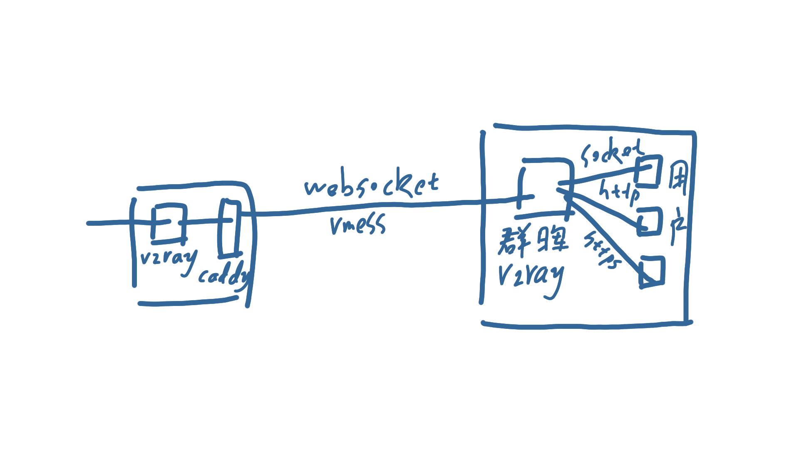
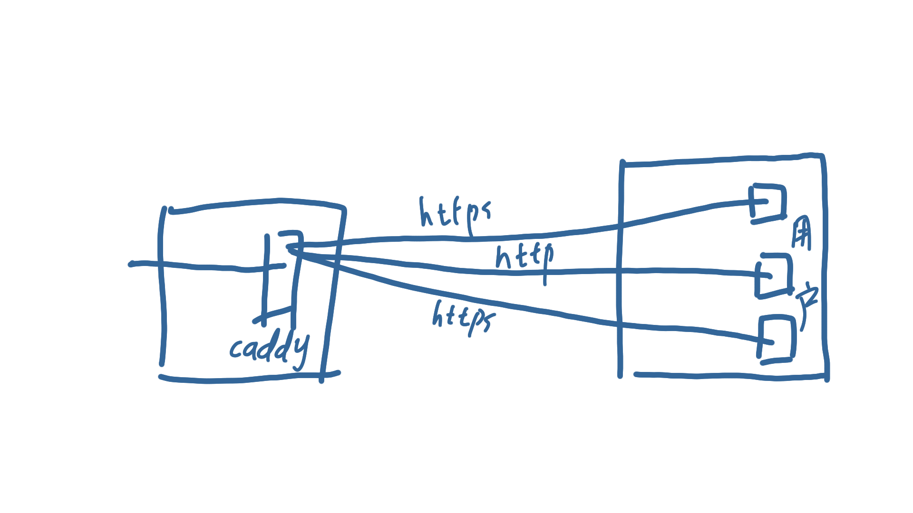

关于搭建代理和异地组网的一些想法。

<!-- more -->

异地组网暂且不说，先说一下代理问题，因为公司有一些特殊需求，需要使用代理上网。因为我住在学校里，网络算是校园网，可以使用学校的一些资源，公司其他同事有的时候也需要用一下，所以就需要搭建一个代理。

先说一下基本情况，宿舍是一百兆电信宽带，上下不对等。公司是一百兆电信宽带，上下对等。再说一下可以利用的资源，宿舍有台小服务器，还在上面搭建了一个软路由，公司有台群晖。

## 第一种方案

我最开始的构想是：




在宿舍的服务器和公司的群晖之间创建一个vmess连接，然后在公司就可以通过群晖代理上网了。

## 第二种方案

后来我就在想，为什么不把宿舍的服务器直接搞成一个代理服务器，然后再公司使用正向代理上网呢？大概就是下面这张图这样：



这里使用了Caddy做正向代理，需要插件 `http.forwardproxy`

```
https://a.b.com {
    gzip
    tls /xxx.pem /xxx.key
    forwardproxy {
        basicauth user password
        hide_ip
    }
}
```

浏览器使用插件 [SwitchyOmega](https://chrome.google.com/webstore/detail/proxy-switchyomega/padekgcemlokbadohgkifijomclgjgif)，就可以使用搭建好的代理去上网了。

宿舍的路由器上还加了一层透明代理，这样通过宿舍的服务器正向代理上网，顺便还能实现留学上网（我也不知道留学上网这个名词是怎么来的 ╮(╯-╰)╭ ）。

因为某些特殊的原因，具体配置文件和搭建方法我就不贴出来了，反正网上都有，稍微思考一下就能想出来怎么搞。