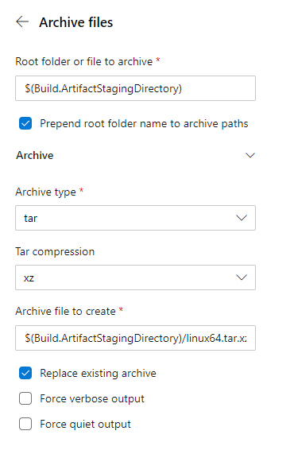
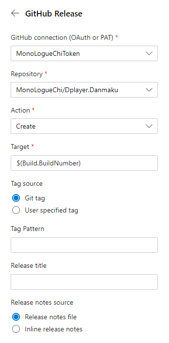
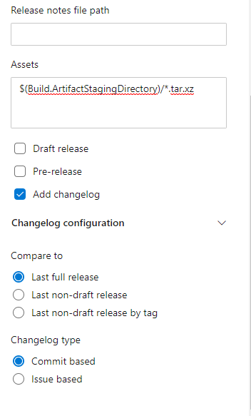

前段时间给我的一个项目上了Azure DevOps 的 Pipelines，顺带着就给那个项目的文档和这个博客一起换上了 Azure 的 CI。

<!-- more -->

## 开始使用

先在 [https://azure.microsoft.com/en-us/services/devops/](https://azure.microsoft.com/en-us/services/devops/) 使用GitHub登录，具体是不是必须要绑定一个微软账号我记不清了。

然后就是授权什么的，选定你需要用ci的项目，然后巴拉巴拉一度操作，这些不重要的就略过了，详细说一下后面的操作。

## GitHub Releases

这个是我的[弹幕后端](https://github.com/MonoLogueChi/Dplayer.Danmaku)配置的CI，简单说一下流程，就是我push到`master`分支，ci会自动帮我检查编译，需要发布新版本的时候，只需要创建一个tag就可以了，这个时候ci会帮我自动编译，并发布一个新版本出来。

如果你也需要做 .net core 项目的ci，可以参考一下我写的配置文件。

编辑界面是这样的，后面会简单解释一下这个是怎么写出来的。


```yaml azure-pipelines.yml
trigger:
- master
- releases/*

pool:
  vmImage: 'ubuntu-latest'
```
这一部分没什么说的，看文档就好了，master分支和releases会触发ci，系统镜像是 Ubuntu 18.04（写这篇文章的时候是这样的，以后可能会更新）。

```yaml azure-pipelines.yml
steps:
- task: DotNetCoreCLI@2
  inputs:
    command: publish
    publishWebProjects: True
    arguments: '-c Release-Linux64 -r linux-x64 --self-contained false --output $(Build.ArtifactStagingDirectory)'
    zipAfterPublish: False

- task: ArchiveFiles@2
  inputs:
    rootFolderOrFile: '$(Build.ArtifactStagingDirectory)/Danmaku'
    includeRootFolder: true
    archiveType: 'tar'
    tarCompression: 'xz'
    archiveFile: '$(Build.ArtifactStagingDirectory)/linux64.tar.xz'
    replaceExistingArchive: true

- task: GithubRelease@0
  displayName: 'Edit GitHub Release'
  inputs:
    gitHubConnection: MonoLogueChiToken
    repositoryName: MonoLogueChi/Dplayer.Danmaku
    action: create
    tag: $(Build.BuildNumber)
    assets: $(Build.ArtifactStagingDirectory)/*.tar.xz

```

这一部分就是任务流程了

第一个任务是publish，也就是编译。在侧栏的Task里找到 `.NET Core`，应该就是第一个，然后选择`publish`，参数的话就是你在正常发布时候用的参数，不懂的可以看[文档](https://docs.microsoft.com/zh-cn/dotnet/core/tools/dotnet-publish)


这样就好发布一个版本出来，在`$(Build.ArtifactStagingDirectory)`目录下。

发布完成以后就是打包，由于是Linux版本，就用tar压缩，我选择的是tar.xz。找到`Archive files`，然后填上参数就可以了。



打包也完成了，就剩最后一步，发布，上传到GitHub上。

首先要有一个GitHub Connection，需要使用Token连接，这个具体操作看[文档](https://docs.microsoft.com/en-us/azure/devops/pipelines/library/service-endpoints?view=azure-devops&tabs=yaml#sep-github)，然后按照下图设置就可以了，其实更简单的是直接复制配置文件然后去更改。

 

需要发布新版本出去的时候，只需要commit之后创建一个tag再push就可以了，这样CI就会自动将编译好的文件发布到GitHub上，并且还会带上更新日志。

## GitHub Pages

这一部分我是纯手打出来的，虽然也有现成的插件，但是那个东西和自己手打有啥区别呢？都不能直接使用GitHub Connection里的Token。我自己也写了一个插件，但是局限性也比较大，后面看看能不能优化一下，如果可以的话争取开源出来。

这一部分主要就是将生成的静态网页提交到`gh-pages`分支上。

```yml azure-pipelines.yml
trigger:
- doc-source

pool:
  vmImage: 'ubuntu-latest'

variables:
- group: github

steps:
- task: UseNode@1
  inputs:
    checkLatest: true
- task: Npm@1
  inputs:
    command: 'custom'
    customCommand: 'install hexo-cli -g'
- task: Npm@1
  inputs:
    command: 'custom'
    customCommand: 'install --pure-lockfile'
- task: Npm@1
  inputs:
    command: 'custom'
    customCommand: 'install --pure-lockfile'
    workingDir: 'themes/hexo-theme-doc/'

- task: CmdLine@2
  inputs:
    script: |
      hexo g
      cd public
      touch .nojekyll
      git config --global user.email "$(EMAIL)"
      git config --global user.name "$(USER)"
      git init
      git add .
      git commit -m update
      git push --force --quiet https://$(TOKEN)@github.com/MonoLogueChi/Dplayer.Danmaku.git master:gh-pages

```

提交到doc-source分支以后，会自动生成静态网页，然后提交到`gh-pages`分支上，其中`EMAIL`、`USER`、`TOKEN`变量都设置再`github`组中，详细设置方法可以看[变量](https://docs.microsoft.com/en-us/azure/devops/pipelines/process/variables?view=azure-devops&tabs=yaml%2Cbatch)和[变量组](https://docs.microsoft.com/en-us/azure/devops/pipelines/library/variable-groups?view=azure-devops&tabs=yaml)相关文档。

再说一下我的博客，因为除了GitHub Pages，还需要提交到又拍云上，还有百度推送，这样就又多了两个步骤

```yml azure-pipelines.yml
trigger:
- master

pool:
  vmImage: 'ubuntu-latest'

variables:
- group: github
- group: upyun
- group: search

steps:
- task: UseNode@1
  inputs:
    checkLatest: true
- task: Npm@1
  inputs:
    command: 'custom'
    customCommand: 'install hexo-cli -g'
- task: Npm@1
  inputs:
    command: 'custom'
    customCommand: 'install --pure-lockfile'

- task: CmdLine@2
  inputs:
    script: |
      #百度搜索推送Token
      sed -i 's/your_token/$(BAIDU_PUSH_TOKEN)/g' ./_config.yml
      hexo g

      #又拍云同步
      wget -O upx http://collection.b0.upaiyun.com/softwares/upx/upx-linux-amd64-v0.2.4
      chmod +x upx
      ./upx login $(BUCKET) $(OPERATOR) $(OPERATOR_PASSWORD)
      ./upx sync public/ / --delete
      ./upx logout
      
      #GitHub Pages
      cd public
      touch .nojekyll
      git config --global user.email "$(EMAIL)"
      git config --global user.name "$(USER)"
      git init
      git add .
      git commit -m update
      git push --force --quiet https://$(TOKEN)@github.com/MonoLogueChi/blog.xxwhite.com.git master:gh-pages

```
