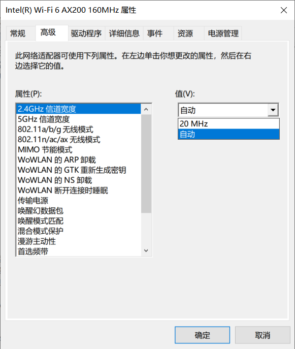

昨天帮同事修笔记本，我那里路由器只开了 5G，但是他的老本子不支持。然后我说给路由器开 2.4G 的时候，给他解释，我这里只开了 5G Wi-Fi，他说“现在运营商也不是不让用 4G”，我想他是搞混了，看来有必要科普一下了。

<!-- more -->

## 2.4G、5G Wi-Fi

简单一点讲，5G Wi-Fi 就是工作在 5GHz 频段的 Wi-Fi，虽然有人说 802.11ac 才能叫 5G Wi-Fi，运行在 5G 上的 802.11n 不能叫 5G，如果这样的话，你管 802.11ax 叫什么？不要把 5G 和 802.11ac 绑定，使用 5GHz 通信的 Wi-Fi，就是 5G Wi-Fi。同样，工作在 2.4GHz 频段的 Wi-Fi 就是 2.4G Wi-Fi。

网上都在说，5G 频段是一条高速路，相比 2.4G 能提供更高的通信速度，其他设备干扰较少等等。缺点是穿墙能力较差，信号衰减快等等。

关于 5G Wi-Fi，普通人只要知道，**5G Wi-Fi 是工作在 5GHz 频段的 Wi-Fi，比 2.4G 更快，但是穿墙能力较差**，其他的不需要过多的了解。

## Wi-Fi6

Wi-Fi6 是什么呢？就是前面稍微提到的一个名词 `802.11ax`。

为什么叫 Wi-Fi6？很简单啊，802.11a/b/g/n/ac/ax，到 ax 这里正好是第 6 代，就叫 Wi-Fi6 咯。

为什么前面没有 Wi-Fi5、Wi-Fi4 呢？这个还真有，Wi-Fi5 就是 802.11ac，Wi-Fi4 就是 802.11n。至于为什么没有人这么叫，这就涉及到一个历史问题了，因为它们是在 2018 年 10 月才改的名字。802.11a/b/g/n/ac 都叫了这么多年了，突然改名，大家在称呼上的改变估计也要过很久。但是 802.11ax 不一样，它一出生就顶着 Wi-Fi6 的名字，而且对于大多数人来说，Wi-Fi6 相比 802.11ax 更容易理解。

说了关于名字的事，简单介绍一下 802.11ax，2018 年 10 月份，802.11ax 成为正规军。802.11ax 支持 2.4GHz 和 5GHz 频段，向下兼容 a/b/g/n/ac，支持的最高带宽为 2.4Gbps。需要了解的是，**Wi-Fi6 就是 802.11ax 标准，比 802.11ac 更快，可以工作在 5GHz 和 2.4GHz 频段**，目前来说商用产品较少，价格较高。

这里顺便提一句，路由器这种东西，三五百块钱的真不贵，新装修的房子，尽量用上 ac+ap 的 Wi-Fi 部署方式，一次多投资一点，以后肯定能少一些麻烦，至于是否需要支持 802.11ax，那就要看经济实力了，现在是没必要，但是再过几年就说不准了。光纤，光交换机以后肯定也会越来越便宜，布线的时候尽量预埋光纤。

吐槽一下，我笔记本网卡换了支持 802.11ax 协议的 ax200，但是路由器却是一个 150M 路由器（只支持 802.11a/b/g/n），别说 802.11ax 了，连 802.11ac 都用不上，现在用的是 25 块钱买的 au 路由器，以后自己买房了肯定上一个好一点的路由器。都说好马配好鞍，我现在有了好鞍却没有好马。

## 5G

5G，第五代移动通信技术。

2019 年，5G 炒的很火，大家都想拿 5G 搞点事情，都想分一块蛋糕。5G 有什么不一样？更快？

更快有两方面的含义，一个是网速更快，也就是通常说的下载速度更快，这也是大众比较关心的一方面。作为一个程序猿，我更关心的是另一个方面，延时更低。打开一个正常的网页，用 10M 网和 100M 网，哪个更快？但从打开网页这方面，10M 网和 100M 网的带宽都不会有瓶颈，真正的差别是延时，也就是 TTFB，也就是你发出请求，多久服务器才能给你回应，放在游戏里面，体现出来的就是 Ping 值。

作为一个 VR 开发者，简单解释一下为什么很多人想把 VR 和 5G 结合起来？就是因为 5G 具有低延时的特点。如果仅仅是看带宽的话，4G 也不是不能用，只是画质可能压缩的严重一点，重点在延时上，VR 对延时的要求特别高。如果从你做出动作，到画面渲染到眼镜里，这个过程时间过长的话，眩晕感会特别强烈，基本上只要超过 20ms，就别想正常游戏了，玩一分钟下来就想吐，比较好的体验是控制在 12ms 左右（当然是越低越好）。利用 5G 低延时的特点，预想是可以在云端渲染，也了解过华为这方面的工作，现在他们在实验室里延时也就降低到勉强能用（他们说的能用，我也不知道眩晕感有多强），到商用，路还远着呢。

## 频宽

我不是学通信的，对于这东西理解也不是很透彻，所以不能瞎讲，只需要知道，**频宽越大，传输速率越高**。

比如 802.11n 的 2.4G 和 5G，都可以选择 20MHz 和 40MHz 的频宽，当使用 40MHz 频宽时，速度会更快。
802.11ac 使用 Wave2 可以使用 160MHz 的频宽，也就是有更高的速度。

 
