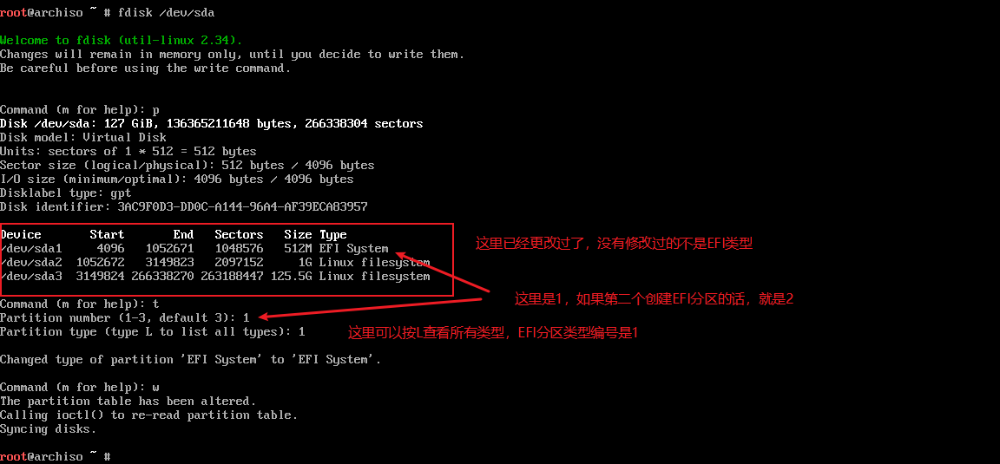
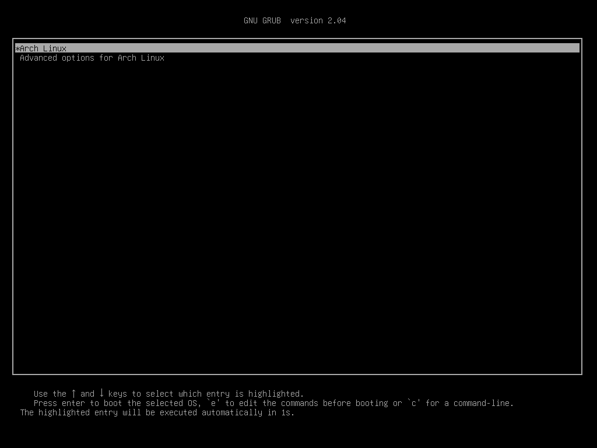

以前一直觉得ArchLinux安装很麻烦，不敢尝试，现在自以为Linux已经有一些基础了，就打算试一下。参考[ArchWiki](https://wiki.archlinux.org/index.php/Installation_guide)，结合自己了解的一点知识，记录一下安装过程。

顺便说一下，想要玩转这个东西，看教程的时候一定要明白每一步的命令是在做什么，如果想要使用和教程不一样的方法，命令应该怎么写。比如想要boot单独分区，这个时候应该怎么挂载。

<!-- more -->

建议第一次尝试在虚拟机里安装，等熟悉了再上手，这个对新手真不简单，本文演示环境是Hyper-V虚拟机，没有安装图形界面，所以不会介绍显卡驱动值之类的问题。

## 准备工作

### 下载镜像

先下载一个Arch的镜像，建议从国内的镜像源去下载，可以直接从[华为开源镜像站](https://mirrors.huaweicloud.com/archlinux/iso/)下载。

### 制作启动盘

由于本文是在虚拟机里面安装，就没有这一步了，改成创建虚拟机，具体步骤就不记录了。但是有一点一定要注意，一定要能联网。

创建完虚拟机以后，挂载虚拟光驱，关闭安全启动，然后调整启动顺序为从光盘启动。连接，开机。

启动U盘建议使用[rufus](http://rufus.ie/)制作，都是傻瓜一键式，很简单的。

### 验证启动模式

现在大部分都说uefi启动了，bios方式本文就不记录了，就是记录上也是抄的别人的，没验证过的东西。如果哪里有不一样的地方，会顺带提一下，不一样的地方可以去参考[WiKi](https://wiki.archlinux.org/index.php/Installation_guide)

```
# ls /sys/firmware/efi/efivars
```

### 联网

```
# dhcpcd
```

如果路由器设置是动态分配ip的话，一般没啥问题，如果是静态ip，或者是使用无线网络，请参考[WiKi](https://wiki.archlinux.org/index.php/Installation_guide)

验证联网

```
# ping www.baidu.com
```

### 更新系统时间

```
# timedatectl set-ntp true
```

### 磁盘分区

这一步是重点，和WiKi有点不一样，仔细看。

查看磁盘

```
# fdiks -l
```

```
# fdisk /dev/sda
```

然后按照下图所示的方法创建几个分区，这里想怎么分就怎么分。只是你分完了分区别忘了挂载就可以了，我自认为自己的分区方法还算比较合理的，适合大部分用户使用。


上图还没有做完，还需要修改分区类型(最后不需要w，我是因为忘记改了，才直接w写入的)



如果是bios启动，不需要创建EFI分区，如果是已经有分区表的磁盘，不需要输入g创建gpt分区表。

然后再格式化分区

```
# mkfs.fat /dev/sda1

# mkfs.ext4 /dev/sda2

# mkfs.ext4 /dev/sda3
或
# mkfs.btrfs /dev/sda3
```

### 挂载分区

```
# mount /dev/sda3 /mnt

# mkdir /mnt/boot
# mkdir /mnt/efi

# mount /dev/sda2 /mnt/boot
# mount /dev/sda1 /mnt/efi
```

如果你不想这么做，想要把efi目录放在boot目录下，也是可以的，也就是`mkdir /boot/efi`和`mount /dev/sda1 /mnt/boot/efi`，后面安装引导时候的命令也会改变。反正如果你理解了Linux目录和分区是怎么回事，就可以想怎么搞就怎么搞。

如果是BIOS方式启动的话，这里没有efi分区的事。

## 安装

### 选择镜像

同样选择华为开源镜像，修改`/etc/pacman.d/mirrorlist`

```
# vim /etc/pacman.d/mirrorlist
```

在前面插入

```properties /etc/pacman.d/mirrorlist
Server = https://mirrors.huaweicloud.com/archlinux/$repo/os/$arch
```

### 安装基本包

```
# pacstrap /mnt base base-devel linux
```

## 配置系统

### Fstab

先配置分区挂载

```
# genfstab -U /mnt >> /mnt/etc/fstab
```

或者

```
# genfstab -L /mnt >> /mnt/etc/fstab
```

前面两个命令都可以，只是一个使用UUID，一个使用卷标。配置之后再检查一下

```
# cat /mnt/etc/fatab
```

### Chroot

change root，也就是离开live环境，把操作权交给新安装的系统。

```
# arch-chroot /mnt
```

### 设置时区

```
# ln -sf /usr/share/zoneinfo/Asia/Shanghai /etc/localtime

# hwclock --systohc
```

### 提前安装一些软件包

因为后面需要用到一些软件，所有提前安装好

```
# pacman -S vim net-tools
```

### 语言本地化

修改`/etc/locale.gen`

```
# vim /etc/locale.gen
```

把下面几行注释删除，使其生效

```properties /etc/locale.gen
en_US.UTF-8 UTF-8
zh_CN.UTF-8 UTF-8
zh_TW.UTF-8 UTF-8
```
接着执行 locale-gen 
```
# locale-gen
```

创建locale.conf，并编辑
```
# vim /etc/locale.conf
```

插入

```properties  locale.conf
LANG=en_US.UTF-8
```

### 配置网络

首先设置主机名，比如说我设置的叫arch

```
# vim /etc/hostname
```

```properties /etc/hostname
acrh
```

修改hosts，添加下面的内容

```
# vim /etc/hosts
```

```properties /etc/hosts
127.0.0.1        localhost
::1		         localhost
127.0.1.1	     arch.local        arch
```

### 设置root密码

```
# passwd
```

## 安装引导程序

### 安装Intel-ucode

这一步可省略，非intel跳过

```
# pcanma -S intel-ucode
```

### 安装grub

这里如果是BIOS方式启动，会不一样，EFI启动可以接着看

这一步之前请先检查`/boot`目录

```
# ls /boot
```

查看是否有

```
initramfs-linux-fallback.img
initramfs-linux.img
vmlinuz-linux
```

如果没有这几个文件，就是Linux没有部署好，执行

```
# pacman -S linux
```

然后再重新检查，确定有这几个文件，继续安装引导

安装os-prober、grub和efibootmgr

```
# pacman -S os-prober grub efibootmgr
```

部署grub

```
# grub-install --target=x86_64-efi --efi-directory=/efi --bootloader-id=grub
```

生成配置文件

```
# grub-mkconfig -o /boot/grub/grub.cfg
```

## 安装完成

完活，重启

```
# exit
# reboot
```

重启以后会看到如下画面



再接下来就是设置交换分区文件，配置ssh等等，这些都说常识操作了，就不再记录了。
