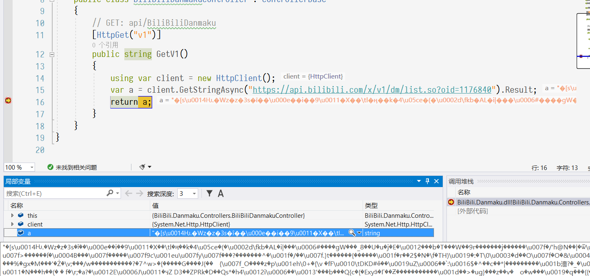
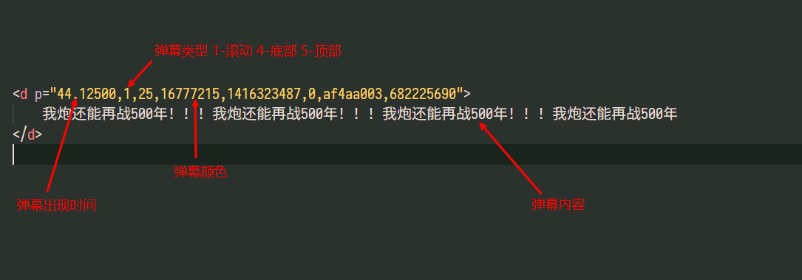

简单说一下我开发的[弹幕后端](https://github.com/MonoLogueChi/Dplayer.Danmaku)的 BiliBili 弹幕解析过程，总结一下以前犯得新手错误，我的程序不是能用就行，我在能用的情况下还要有效率。

<!-- more -->

> 超长文章预警，附带解题思路

## B 站弹幕接口

目前我用的 B 站弹幕接口有：

- `https://api.bilibili.com/x/v1/dm/list.so?oid={cid}`
- `https://api.bilibili.com/x/v2/dm/history?type=1&oid={cid}&date={date}`

第一个用于查询弹幕，第二个是查询历史弹幕。

关于历史弹幕这里要说一点，有些视频弹幕过多，默认只会显示最近的一部分弹幕，过多的都会在历史弹幕里面，但是历史弹幕的接口需要登录，后面会说登录的事。

查询弹幕的 cid 以前可以在分享里看的，现在好像是给隐藏掉了，不过幸好还有查询 cid 的接口

- `https://www.bilibili.com/widget/getPageList?aid={aid}`

上面的这个接口可以使用 av 号查询 cid。

前面三个接口先在浏览器里看一下，如果我不说下面这几个坑，没有爬虫经验的 C# 程序猿没准都不知道怎么解决

[https://api.bilibili.com/x/v1/dm/list.so?oid=1176840](https://api.bilibili.com/x/v1/dm/list.so?oid=1176840)


注意一下，压缩算法是 `deflate`，编码 `UTF-8`，这里我踩过坑，压缩算法先看好了。

[https://www.bilibili.com/widget/getPageList?aid=810872](https://www.bilibili.com/widget/getPageList?aid=810872)


注意，压缩算法是 `gzip`，编码 `UTF-8`。

## Http 请求

### 基础

先使用最简单的方法获取数据，跑通了再优化。

可以参考这篇[文档](https://docs.microsoft.com/zh-cn/dotnet/csharp/tutorials/console-webapiclient)

使用 .net core 版本为 3.1。

```cs BiliBiliDanmakuController.cs
using System.Net.Http;
using Microsoft.AspNetCore.Mvc;

namespace BiliBili.Danmaku.Controllers
{
    [Route("api/danmaku")]
    [ApiController]
    public class BiliBiliDanmakuController : ControllerBase
    {
        [HttpGet("v1")]
        public string GetV1()
        {
            var client = new HttpClient();
            var a = client.GetStringAsync("https://api.bilibili.com/x/v1/dm/list.so?oid=1176840").Result;
            return a;
        }
    }
}
```

上面写的代码是中规中矩，看上去可以，但是一运行就会出问题。



解析出来的全都是乱码，为什么会这样呢？还记得上面说的压缩算法吗？

这个时候就有几种不同的解决思路了，我先说一下我最开始的解决思路，先用 `GetStreamAsync()` 直接获取数据流，然后再写一个解压方法，使用 `deflate` 算法解压数据流。

```cs BiliBiliDanmakuController.cs
using System.IO;
using System.IO.Compression;
using System.Net.Http;
using Microsoft.AspNetCore.Mvc;

namespace BiliBili.Danmaku.Controllers
{
    [Route("api/danmaku")]
    [ApiController]
    public class BiliBiliDanmakuController : ControllerBase
    {
        [HttpGet("v1")]
        public string GetV1()
        {
            using var client = new HttpClient();
            var a = client.GetStreamAsync("https://api.bilibili.com/x/v1/dm/list.so?oid=1176840").Result;
            return DeDeflate(a);
        }

        private string DeDeflate(Stream s)
        {
            using var gZipStream = new DeflateStream(s, CompressionMode.Decompress);
            using var reader = new StreamReader(gZipStream);
            return reader.ReadToEndAsync().Result;
        }
    }
}
```

我最开始用的是 `WebClient`，和 `HttpClient` 差不多，思路是一样。

上面的代码只能说能用，下面说一下另一种方法，也是我现在采用的方法。

从[相关文档](https://docs.microsoft.com/zh-cn/dotnet/api/system.net.http.httpclienthandler?view=netcore-3.1)了解到，可以使用下面的方法

```cs BiliBiliDanmakuController.cs
using System.Net;
using System.Net.Http;
using Microsoft.AspNetCore.Mvc;

namespace BiliBili.Danmaku.Controllers
{
    [Route("api/danmaku")]
    [ApiController]
    public class BiliBiliDanmakuController : ControllerBase
    {
        [HttpGet("v1")]
        public string GetV1()
        {
            var handler = new HttpClientHandler {AutomaticDecompression = DecompressionMethods.Deflate};
            var client = new HttpClient(handler);
            var a = client.GetStringAsync("https://api.bilibili.com/x/v1/dm/list.so?oid=1176840").Result;
            return a;
        }
    }
}
```

cid 的查询接口使用的压缩算法是 gzip，处理方式类似，就不再赘述了。

### 优化

前面只是能跑通了，但是并没有涉及到优化的问题。

首先是关于 `HttpClientHandler` 的问题，从[相关文档](https://docs.microsoft.com/zh-cn/dotnet/api/system.net.http.socketshttphandler?view=netcore-3.1)了解到，.net core 2.1 以后，使用 `SocketsHttpHandler` 代替处理。

接下来还有[其他问题](https://docs.microsoft.com/zh-cn/dotnet/architecture/microservices/implement-resilient-applications/use-httpclientfactory-to-implement-resilient-http-requests)。

> 常见的原始 HttpClient 类非常易于使用，但在某些情况下，许多开发人员却并未正确使用该类。
> 第一个问题，当此类可释放时，将其用于 using 语句并不是最佳选择，因为即使释放 HttpClient 对象，基础套接字也不会立即释放，并可能导致严重问题：“套接字耗尽”。 有关此问题的详细信息，请参阅你正在以错误方式使用 HttpClient，这将导致软件受损博客文章。
> 因此，HttpClient 应进行一次实例化并在应用程序的生命周期中重复使用。 在负载较重的情况下，实例化每个请求的 HttpClient 类将耗尽可用的套接字数。 该问题会导致 SocketException 错误。 要解决此问题，可能的方法是将 HttpClient 对象创建为单一对象或静态对象，请参阅关于 HttpClient 用法的 Microsoft 文章中的说明。
> 但将 HttpClient 对象用作单一对象或静态对象时还有一个问题。 在这种情况下，单一实例或静态 HttpClient 不考虑 DNS 更改，请参阅 dotnet/corefx GitHub 存储库中的此问题中的说明。
> 为解决上述问题并使 HttpClient 实例管理更轻松，.NET Core 2.1 引入了新的 HttpClientFactory，后者可与 Polly 集成来实现弹性 HTTP 调用。

说实话，看微软的文档是真的难受，要不是有人找出来，完全不知道该怎么看。

可以优化成下面这样的程序

```cs BiliBiliDanmakuController.cs
using System.Net;
using System.Net.Http;
using Microsoft.AspNetCore.Mvc;

namespace BiliBili.Danmaku.Controllers
{
    [Route("api/danmaku")]
    [ApiController]
    public class BiliBiliDanmakuController : ControllerBase
    {
        private static readonly HttpClientHandler Handler =
                new HttpClientHandler { AutomaticDecompression = DecompressionMethods.Deflate };
        private static readonly HttpClient Client = new HttpClient(Handler);

        [HttpGet("v1")]
        public string GetV1()
        {
            var a = Client.GetStringAsync("https://api.bilibili.com/x/v1/dm/list.so?oid=1176840").Result;
            return a;
        }
    }
}
```

再根据[相关文档](https://docs.microsoft.com/zh-cn/aspnet/core/fundamentals/http-requests?view=aspnetcore-3.1)，可以这样做，修改 `Startup.cs` 。

```cs Startup.cs
public void ConfigureServices(IServiceCollection services)
{
    services.AddControllers();
    services.AddHttpClient("deflate").ConfigurePrimaryHttpMessageHandler(() =>
        new SocketsHttpHandler { AutomaticDecompression = DecompressionMethods.Deflate });
}
```

这样就可以写

```cs BiliBiliDanmakuController.cs
using System.Net;
using System.Net.Http;
using Microsoft.AspNetCore.Mvc;

namespace BiliBili.Danmaku.Controllers
{
    [Route("api/danmaku")]
    [ApiController]
    public class BiliBiliDanmakuController : ControllerBase
    {
        private readonly HttpClient _client;

        public BiliBiliDanmakuController(IHttpClientFactory httpClientFactory)
        {
            _client = httpClientFactory.CreateClient("deflate");
        }

        [HttpGet("v1")]
        public string GetV1()
        {
            var a = _client.GetStringAsync("https://api.bilibili.com/x/v1/dm/list.so?oid=1176840").Result;
            return a;
        }
    }
}
```

或者是用以下的解决方式，[文档](https://docs.microsoft.com/zh-cn/dotnet/architecture/microservices/implement-resilient-applications/use-httpclientfactory-to-implement-resilient-http-requests)

```cs HttpBilibili.cs
using System.Net.Http;
using System.Threading.Tasks;

namespace BiliBili.Danmaku.Utils
{
    public class HttpBilibili
    {
        private readonly HttpClient _httpClient;

        public HttpBilibili(HttpClient client)
        {
            _httpClient = client;
        }

        public Task<Stream> GetDanmakuByCid(int cid)
        {
            return _httpClient.GetStreamAsync($"https://api.bilibili.com/x/v1/dm/list.so?oid={cid}");
        }
    }
}
```

```cs Startup.cs
public void ConfigureServices(IServiceCollection services)
{
    services.AddControllers();
    services.AddHttpClient<HttpBilibili>().ConfigurePrimaryHttpMessageHandler(() =>
        new SocketsHttpHandler { AutomaticDecompression = DecompressionMethods.Deflate });
}
```

```cs BiliBiliDanmakuController.cs
using System.Threading.Tasks;
using BiliBili.Danmaku.Utils;
using Microsoft.AspNetCore.Mvc;

namespace BiliBili.Danmaku.Controllers
{
    [Route("api/danmaku")]
    [ApiController]
    public class BiliBiliDanmakuController : ControllerBase
    {
        private readonly HttpBilibili _bilibili;

        public BiliBiliDanmakuController(HttpBilibili bilibili)
        {
            _bilibili = bilibili;
        }

        [HttpGet("v1")]
        public Task<Stream> GetV1()
        {
            var a = _bilibili.GetDanmakuByCid(1176840);
            return a;
        }
    }
}
```

至此，Http 请求部分就算是完成了后面就是反序列化的问题了。

## 反序列化

说实话，反序列化相比上面，就简单的多了。

```xml
<i>
    <chatserver>chat.bilibili.com</chatserver>
    <chatid>1176840</chatid>
    <mission>0</mission>
    <maxlimit>3000</maxlimit>
    <state>0</state>
    <real_name>0</real_name>
    <source>e-r</source>
    <d p="44.12500,1,25,16777215,1416323487,0,af4aa003,682225690">
        我炮还能再战500年！！！我炮还能再战500年！！！我炮还能再战500年！！！我炮还能再战500年
    </d>
    <d p="52.63100,5,18,15772458,1416575349,0,f9289c56,684620215">
        我炮还能再战五百年★☆★☆吾等炮党愿万世轮回❤只为换取公主一世笑颜★☆★☆我炮还能再战五百
    </d>
    <d p="44.93300,5,25,16737792,1417309755,0,fb8ee8a9,693992629">
        我炮再战500年！在弹幕里为姐姐大人加油！我炮再战500年！在弹幕里为姐姐大人加油！我炮再战500年！在弹幕里为姐姐大人加油！
    </d>
</i>
```

上面只是截取了一小段，我们需要的仅仅是 `d` 标签，复制上面的内容，利用 Visual Studio 的选择性粘贴功能，创建一个类

`编辑` > `选择性粘贴` > `将XML粘贴为类`

然后适当的修改，下面的这段代码可能和直接粘贴的差别有点大，但肯定是从那里直接修改过来的。

```cs DanmakuXml.cs
using System;
using System.ComponentModel;
using System.Xml.Serialization;

namespace BiliBili.Danmaku.Model
{
    [SerializableAttribute]
    [DesignerCategory("code")]
    [XmlType(AnonymousType = true)]
    [XmlRoot("i", Namespace = "", IsNullable = false)]
    public class DanmakuXml
    {
        [XmlElement("d")] public iD[] D { get; set; }
    }

    [SerializableAttribute]
    [DesignerCategory("code")]
    [XmlType(AnonymousType = true)]
    public class iD
    {
        [XmlAttribute("p")] public string P { get; set; }

        [XmlText] public string Value { get; set; }
    }
}
```

然后对前面的 xml 解析，提前已经知道映射关系了。



在前面的 Http 请求部分，我把最后一次的返回类型从 `string` 改成了 `Stream` ，前面的 `string` 类型只是在测试的时候方便 Debug，改成 Stream 类型是为了优化右面的反序列化。

```cs
public async Task<DanmakuXml> DXml()
{
    var a = _bilibili.GetDanmakuByCid(1176840);
    return new DanmakuXml(await a);
}
```

```cs DanmakuXml.cs
using System;
using System.Collections.Generic;
using System.ComponentModel;
using System.IO;
using System.Linq;
using System.Text;
using System.Xml.Serialization;

namespace BiliBili.Danmaku.Model
{
    [SerializableAttribute]
    [DesignerCategory("code")]
    [XmlType(AnonymousType = true)]
    [XmlRoot("i", Namespace = "", IsNullable = false)]
    public class DanmakuXml
    {
        public DanmakuXml() { }

        /// <summary>
        ///     从Dplayer弹幕转换
        /// </summary>
        /// <param name="ds"></param>
        public DanmakuXml(List<DanmakuData> ds)
        {
            D = ds.Select(d => new iD
            {
                P = $"{d.Time},{(d.Type == 2 ? 4 : d.Type == 1 ? 5 : 1)},25,{d.Color},1512931469,1,354b5ade,4028451968",
                Value = d.Text
            }).ToArray();
        }

        /// <summary>
        ///     反序列化
        /// </summary>
        /// <param name="s"></param>
        public BilibiliDanmakuData(Stream s)
        {
            var serializer = new XmlSerializer(typeof(BilibiliDanmakuData));
            var bd = (BilibiliDanmakuData) serializer.Deserialize(s);
            D = bd.D;
        }

        [XmlElement("d")] public iD[] D { get; set; }

        /// <summary>
        ///     转通用Data
        /// </summary>
        /// <returns></returns>
        public IEnumerable<DanmakuData> ToDanmakuDataList()
        {
            return D.Select(s =>
            {
                var d = s.P.Split(",");
                var t = int.Parse(d[1]);
                return new DanmakuData
                {
                    Time = float.Parse(d[0]),
                    Color = int.Parse(d[3]),
                    Type = t == 4 ? 2 : t == 5 ? 1 : 0,
                    Author = "",
                    Text = s.Value
                };
            });
        }

        public string ToXml()
        {
            using var ms = new MemoryStream();
            var x = new XmlSerializer(typeof(BilibiliDanmakuData));
            x.Serialize(ms, this);
            return Encoding.UTF8.GetString(ms.ToArray());
        }
    }

    [SerializableAttribute]
    [DesignerCategory("code")]
    [XmlType(AnonymousType = true)]
    public class iD
    {
        [XmlAttribute("p")] public string P { get; set; }

        [XmlText] public string Value { get; set; }
    }
}
```

```cs DanmakuData.cs
using System.Text.Json;
using System.Text.Json.Serialization;

namespace BiliBili.Danmaku.Model
{
    public class DanmakuData
	{
        public float Time { get; set; }

		public int Type { get; set; }

		public int Color { get; set; }

		[MaxLength(16)] public string Author { get; set; }

		[MaxLength(255)] public string Text { get; set; }

		public string ToJson()
		{
			return JsonSerializer.Serialize(this);
		}

		public static DanmakuData FromJson(string json)
		{
			return JsonSerializer.Deserialize<DanmakuData>(json);
		}
	}
}
```


如果前面还是用 `GetStringAsync()` 的话，就要用到

```cs
public async Task<DanmakuXml> DXml()
{
    var a = _bilibili.GetDanmakuByCid(1176840);  //这里a的类型是 Task<string>
    using StringReader sr = new StringReader(await a);
    return new DanmakuXml(sr);
}
```

这样的话就有有一个问题，会有一个 `Stream` -> `string` -> `Stream` 的转换，造成不必要的资源浪费，json 反序列化的时候也是同理，用 `GetStreamAsync()` 而不是 `GetStringAsync()`。

至此，反序列化部分也已经完成了，后面需要的就是序列化，转换成其他播放器可以使用的格式。

后面的部分就比较简单了，相信一个初学者都可以顺利完成，就不再赘述了。
