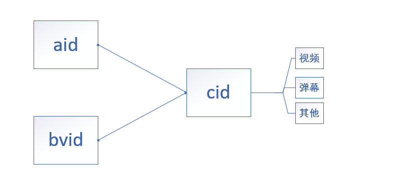

今天开始，BiliBili 视频使用 bv 号代替以前的 av 号，知乎上已经有大佬给出了 bvid 转换成 aid 的算法。

<!-- more -->

## 解释

昨天发现这个问题以后，看了一下 api，使用 bvid 是可以直接查询到 cid 的，这样对我的弹幕服务器影响甚小，对其他的视频下载器或者是什么解析服务影响应该也不大。

简单解释原理，B 站以前有两个比较重要的表示，分别是 aid 和 cid，现在使用 bvid 代替 aid，作用是一样的。不管是解析弹幕还是解析视频，最终都是使用 cid 查询的，大概可以这么理解，aid 或者是 bvid 对应的是投稿，cid 对应的是视频。



以前通过 aid 查询 cid 的 api 主要有两个，分别是

```
https://www.bilibili.com/widget/getPageList?aid={aid}
https://api.bilibili.com/x/player/pagelist?aid={aid}
```

第一个 api 不能使用 bvid 查询，第二个 api 可以，只需要使用参数 `bvid={bvid}` 即可，比如 `https://api.bilibili.com/x/player/pagelist?bvid=BV18b411j72u`。

## 修改

看过我上一篇文章的知道，我以前使用的是第一个接口，这次需要修改为使用第二个 api，难度不大，只是返回结果数据结构变了，而且压缩算法不再是 gzip 了。

总体来说，改动不大，只需要简单的 api，再加上一个参数就可以了。

具体详情可以看我的 [GitHub 项目](https://github.com/MonoLogueChi/Danmu.Server)

具体代码为 [aaf7e3b ](https://github.com/MonoLogueChi/Danmu.Server/commit/9abca85302d91f0ff72a80abd5232256f78c2e2f)
