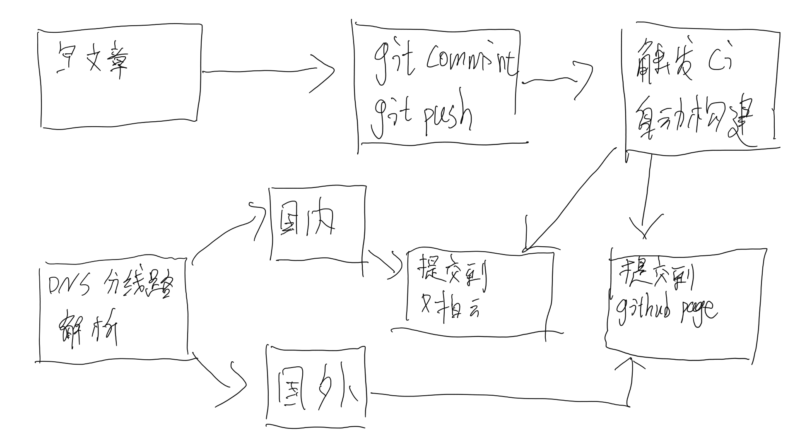
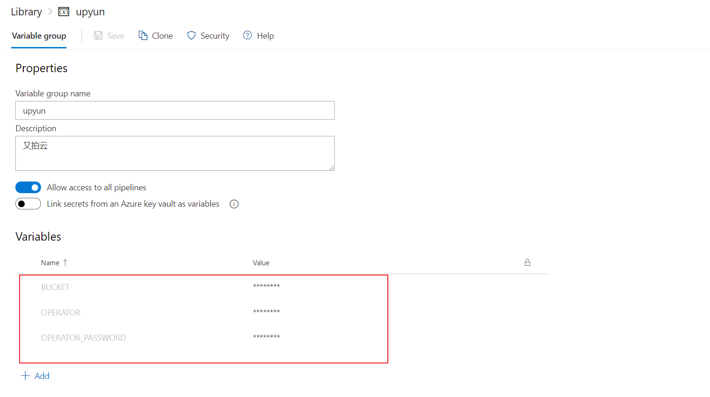
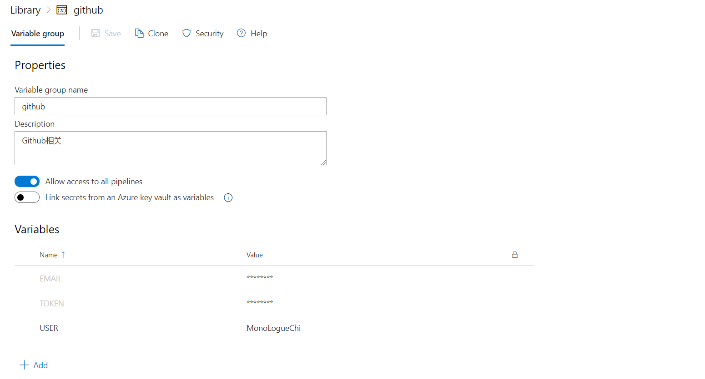

使用 ci 自动化构建博客，只需要写文章就可以了。

<!-- more -->

丝毫没有技术含量的文章，只是简单介绍一下我的博客是怎么使用自动化构建的。

这篇文章中会提到，Hexo 优雅的方式更新主题，Hexo 使用 ci 自动化构建，Hexo 部署到 GitHub Page，Hexo 部署到又拍云（u-file 方法相同）。

一张简图，简单介绍一下我博客现在的情况。



写完文章，往 GitHub 上一推，剩下的就全是自动化的了。

下面简单介绍一下细节

## 主题子模块化

使用子模块更新 Hexo 主题，应该算是一种优雅的主题更新方式了，而且我的主题目前是我自己维护的，使用子模块就更方便了。

在 theme 目录下执行

```
git submodule add https://github.com/MonoLogueChi/hexo-theme-yilia
```

怎么更新子模块，可以自行百度。

主题变成子模块之后，更新是方便了，但是配置文件怎么搞定呢？支持 data 的主题目前来说不多，一种更普遍的方式是把配置文件写在 Hexo 的 `_config.yml` 文件里。

具体方式是，添加一项 `theme_config:` 这里面的配置会覆盖主题的，注意，只会覆盖主题相同项的，所以这里面要完整复制主题的配置文件，然后修改成自己的。

示例：

```yaml
# Hexo Configuration
## Docs: https://hexo.io/docs/configuration.html
## Source: https://github.com/hexojs/hexo/

# Site
title: "叉叉白"
subtitle: "叉叉白，听我跟你瞎白话"
description: "一个小白搞机的记事本"
keywords: 叉叉白
## ...
## 主题
theme_config:
  # Header
  menu:
    主页: "/"
    搞机: "/tags/搞机/"
    笔记: "/tags/建站笔记/"
    时光: "/tags/timeline/"
    留言: "/MessageBoard/"
    关于: "/aboutme/"
  ## ...
```

## 使用 Azure Pipelines

可以免费使用的 ci 有好多，我以自己常用的 Azure Pipelines 为例简单说明一下，其他 ci 可以参考相关文档。

Azure Pipelines 网址是 https://dev.azure.com/ ，以下全部参考 [Azure Pipelines 文档](https://docs.microsoft.com/en-us/azure/devops/pipelines/get-started/pipelines-sign-up?view=azure-devops) ，如果有不理解的，请直接阅读文档。

可以使用 GitHub 登录，然后创建一个 project，在左侧点击 Pipelines，然后点击 new Pipeline，选择 GitHub，选择自己的博客仓库，然后会跳转到 GitHub 让你去授权，这里什么都不需要改，直接翻到最下面去点 `Approve and install`，然后就会再次跳转回 Azure Pipelines，耐心等待就可以，再后面模板随便选一个就可以，选什么无所谓。

然后修改模板，可以直接复制我的，其中部署部分会在下面一节讲解，配置我放在文章最后了。

## 自动化部署到又拍云

自动化部署到又拍云和 u-file 配置是一模一样的，又拍云创建储存空间和绑定域名部分就不讲了，直接说部署。

在 `存储管理` 的最后面找到 `操作员授权` 新建一个操作员


记下创建的操作员名称和密码，等下要用。下面这个表格是 u-file 和又拍云的联系，只需要替换相应的变量，就可以把文件部署到 u-file 上

| 又拍云   | u-file     |
| -------- | ---------- |
| 服务名称 | 存储器名称 |
| 操作员   | 用户名     |
| 密码     | 密码       |

回到 Azure Pipelines，在左侧的 `Library` 选项卡中，新建一个变量组（variable group）。

看下图，记住要填写哪些变量，记得添加完把后面的锁给勾上，表示加密变量。



使用变量组只需要在配置文件中写

```yaml
variables:
  - group: upyun
```

使用其中的变量，可以使用

```
$(BUCKET)
```

部署到又拍云（u-file）需要使用 [upx](https://github.com/upyun/upx) 工具，具体怎么用，可以看本文最后的配置文件示例。

## 部署到 Github Page

部署到 gh-page 需要使用 token，在 github，点击右上角的头像，选择 setting 选项，找到 Developer settings， 在 Personal access tokens 里生成一个新 token，一般来说勾上 `repo`里面的权限就足够了。

记住这个 token，只会出现一次，后面要用。

回到 Azure Pipelines，在左侧的 `Library` 选项卡中，新建一个变量组（variable group）。

看下图，记住要填写哪些变量，记得添加完把后面的锁给勾上，表示加密变量。



使用变量组只需要在配置文件中写

```yaml
variables:
  - group: github
```

详细的配置文件写在了文章最后。

记得在博客的 `source` 目录下创建一个 `CNAME` 文件，写上你的域名，测试 ci 没有问题只会，在仓库的设置里面开启 github page 功能，选择分支 `gh-page`。

## azure-pipelines.yml

```yaml azure-pipelines.yml
trigger:
  - master

pool:
  vmImage: "ubuntu-latest"

variables:
  - group: github
  - group: upyun

steps:
  - checkout: self
    fetchDepth: 1
    submodules: true

  - task: UseNode@1
    inputs:
      version: "12.x"

  - task: Npm@1
    inputs:
      command: "custom"
      customCommand: "install hexo-cli -g"

  - task: Npm@1
    inputs:
      command: "custom"
      customCommand: "install --pure-lockfile"

  - task: CmdLine@2
    inputs:
      script: |
        hexo g

        #又拍云同步
        wget -O upx http://collection.b0.upaiyun.com/softwares/upx/upx-linux-amd64-v0.2.6
        chmod +x upx
        ./upx login $(BUCKET) $(OPERATOR) $(OPERATOR_PASSWORD)
        ./upx sync public/ / --delete
        ./upx logout

        #部署到GitHub Page
        cd public
        touch .nojekyll
        git config --global user.email "$(EMAIL)"
        git config --global user.name "$(USER)"
        git init
        git add .
        git commit -m update
        git push --force --quiet https://$(TOKEN)@github.com/MonoLogueChi/blog.xxwhite.com.git master:gh-pages
```
