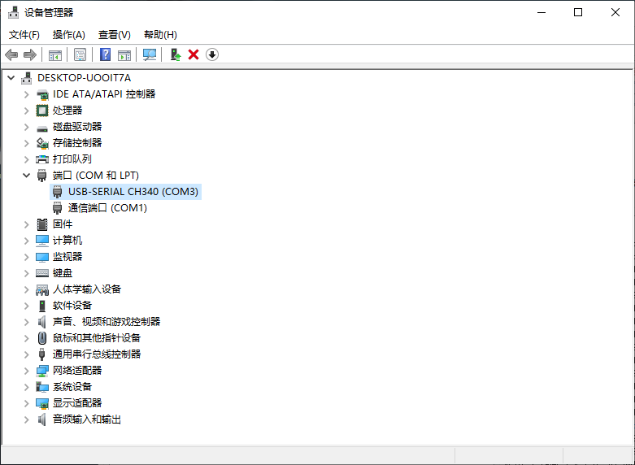
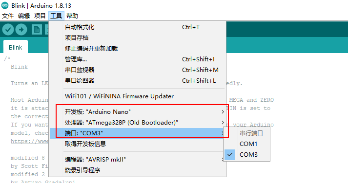
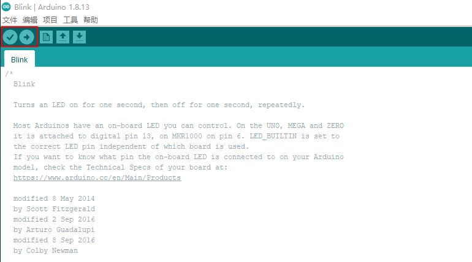
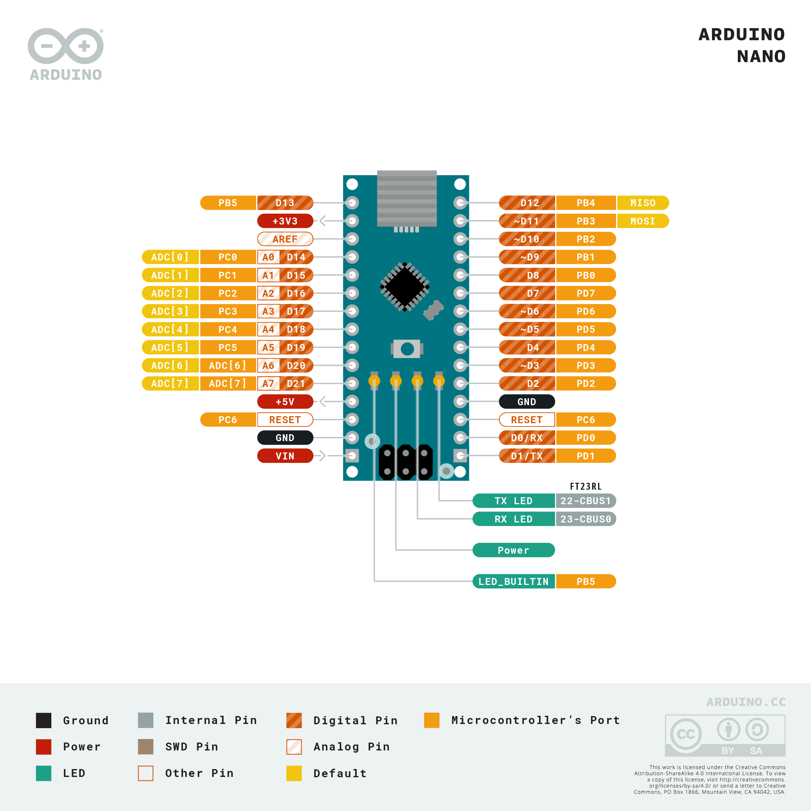
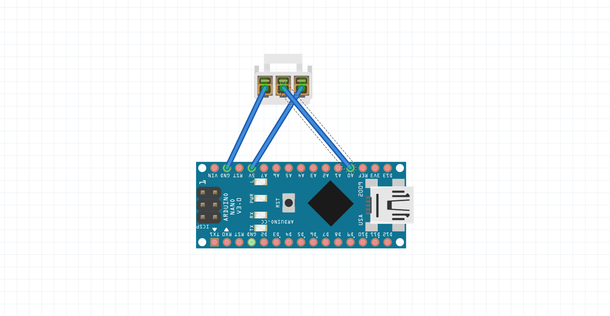
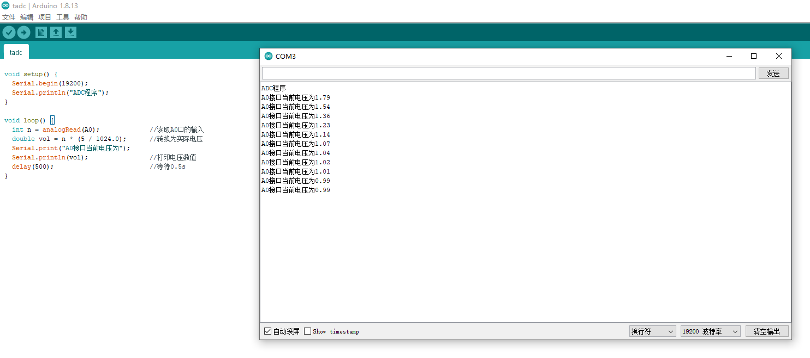

前段时间在做一个硬件上的项目，用到了 Arduino，学了一些知识，也踩了一些坑，简单总结分享一下。

<!-- more -->

## 选购

Arduino 有不少的板子，国产的克隆板用起来也不错，没有必要死扣进口的，当然你如果想要支持 Arduino 的发展，可以购买那种带有 Arduino 授权标志的板子。

Arduino 常用的几种板子有 `Uno` `Mega` `Nano` `Pro micro` `Leonardo`，简单说一下区别和怎么选，不要像我一样，第一次买错了，还要多花一份冤枉钱。

### Uno

首先是 Uno，这款开发板可以说是性价比最高的一款产品，也可以说是最适合初学者学习使用的开发板。就是你不明确自己想要做什么，只是单纯的想要学习，买这块就够了。

### Mega

开发板与 Arduino Uno 类似，但尺寸要比 Uno 开发板更大，引脚更多，当你明确自己需要用很多的传感器，Uno 不能满足的需求的时候，可以选择这款。

### Nano

和 Uno 类似，但尺寸更小，引脚也稍多当你的项目对板子尺寸有要求的时候，可以选择这款，而且这款貌似也是最便宜的。

### Leonardo

功能上比 Uno 类似，但是支持 HID，可以模拟 USB 设备，如果需要模拟键盘鼠标，或者制作 HID 设备（比如赛车模拟器等）的话，Leonardo 是首选。

### Pro micro

与 Leonardo 类似，支持 HID，可以模拟 USB 设备，但是尺寸更小。

## 准备开发

这一步你买板子的卖家一般会告诉你怎么做，遇到不一样的，请按照卖家的做。

开发工具使用 Arduino，我直接使用 scoop 安装，

```
scoop install arduino
```

我用到的板子是 Nano 板，直接 USB 插到电脑上，不需要自己手动安装驱动，Win10 会自动安装，如果不能自动安装，可以找你购买的地方要驱动，或者搜索 `CH340 驱动`。

打开设备管理器，在 `端口` 选项下面找一下



前面看到的端口 COM3，记住端口号，后面要用。

打开 Arduino IDE，文件-示例-Basics-Blink。


这是最简单的一个项目，就是让 L 灯一直闪。

然后在工具一栏选择对应的开发板和处理器



然后点击编译和上传



然后就可以看到 L 灯一闪一闪的了。

## ADC 程序

到了一个正式项目的时候了，我有一个需求是，采集传感器电压。

先上图



在上图可以看到，有 6 个可用的 ADC 引脚，我们使用 A0。

用下图所示的接法接好传感器，其中，然后写程序



```
void setup() {
  Serial.begin(19200);
  Serial.println("ADC程序");
}

void loop() {
  int n = analogRead(A0);             //读取A0口的输入
  double vol = n * (5 / 1024.0);      //转换为实际电压
  Serial.print("A0接口当前电压为");
  Serial.println(vol);                //打印电压数值
  delay(500);                         //等待0.5s
}
```

看，程序是不是超简单，Nano 板具有 10 位 ADC 转换功能，10 位的意思就是最多可以有 2^10^ 个分级，参考电压为 5V，所以转换为实际电压的时候就要用到上面的公式。

编译上传，然后就可以在串口监视器里看到输出了。




最后再说一下使用习惯，不用面包板的时候，我喜欢把这个东西插到另一块板子上，然后从另一块板子上焊排针用。

