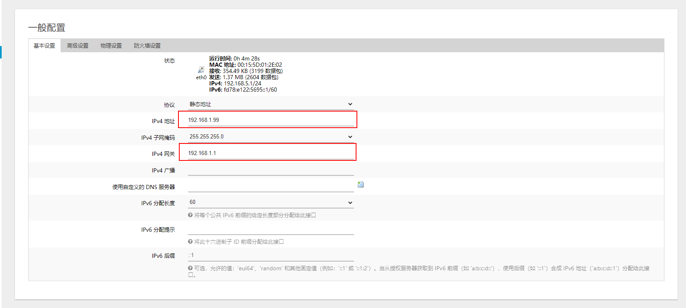
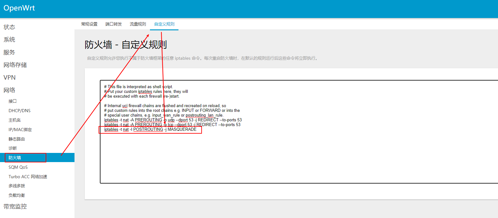
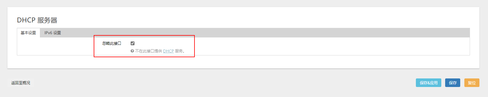

学会设置旁路由，发挥单网口设备的余热。

<!-- more -->

简单说明一下怎么设置旁路由，发挥单网口设备的余热。

## 设备简介

这次演示用的旁路由为 OpenWrt 单网口设备，主路由不方便介绍。

## 旁路由设置

首先正常烧录镜像，不会的可以看[教程](/2020/flash-image.html)，然后正常登录软路由。

设置 LAN 口，修改 LAN 口 IP 为主路由网段下的 IP，修改网关为主路由。



点击保存，先不要点应用。

然后在 `物理设置` 选项卡中取消桥接，直接选择 LAN 网卡，然后保存。


修改防火墙设置，添加

```
iptables -t nat -I POSTROUTING -o eth0 -j MASQUERADE
```



保存，然后点击右上角的未保存的配置，保存并应用。

此时将软路由插到主路由上，并且使用刚才设置的软路由 IP，应该可以正常访问到软路由。

## 如何使用

上面旁路由已经设置完成了，但还是不能生效，我们还需要其他的设置才能使用，下面给出几种方法，任选一种即可。

### 手动指定网关和 DNS

这种方法适用于临时使用，或者是你不想影响其他人正常上网，是最简单，也是最麻烦的一直方法。

首先关闭旁路由的 DHCP



然后在需要设置的电脑上，打开控制面板里的网络连接，然后手动设置 IP 和 DNS，其中网关需要设置为旁路由的 IP，这样运行在旁路由上的服务就可以在这台电脑上使用了。


### 使用主路由的 DHCP

这是最常用的一种方法，需要关闭旁路由的 DHCP，并修改主路由的 DHCP 选项，设置默认网关和 DNS 服务器为旁路由。

我这里主路由不支持修改 DHCP 默认网关，就不放图了，具体可以百度 xxx 路由器修改 DHCP 网关。

OpenWrt 的修改方法可以参考下面。

### 使用旁路由的 DHCP

开启旁路由 DHCP，并且按图设置，指定网关和 DNS 为旁路由，并关闭主路由的 DHCP。


## 补充

经过以上设置之后，在旁路由搞去广告或者其他骚东西，就可以对下面的设备生效了，如果是长期使用，建议由旁路由接管 DHCP，为主路由分担压力。
