在 PVE 虚拟机上安装软路由。

<!-- more -->

## 准备

首先需要准备 PVE 的安装镜像，这个可以在[官网](https://www.proxmox.com/en/downloads)下载，网络不好的同学请自行想办法解决。

然后需要软路由镜像，如果使用爱快的话，也可以直接在[官网](https://www.ikuai8.com/component/download)下载。需要 openwrt 的话，可以到你能找到的地方下载，也可以在我的[网盘](https://dl.u2sb.top/#/s/GPIQ?path=%2Fblog%2F%E8%BD%AF%E8%B7%AF%E7%94%B1%2FOpenWRT)里下载。

准备好镜像之后，需要把 PVE 镜像烧录到 U 盘里。

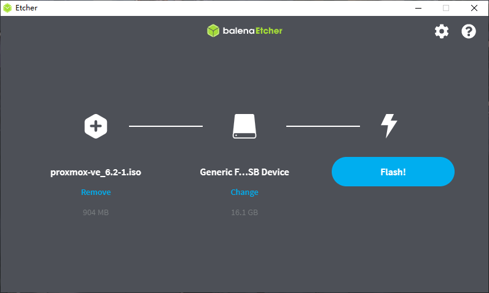

本文演示所用版本为：

- pve 6.2-4
- ikuai iKuai8_3.3.9_Build202006150942

所在网络环境：

- 当前使用路由器，网关为 192.168.1.1

阅读要求：

- 具有一定的解决问题能力，能熟练使用百度等搜索引擎；
- 有一点 Linux 基础知识，常识上的东西要懂，ssh 工具要会用；
- 会在 Linux 上编辑文档，现在不会的话，马上去百度 vi 编辑器使用。

## 虚拟机布置示意图


我这套方案是爱快作为主路由，OpenWRT 作为旁路由，DHCP 服务端在旁路由上，内部设备默认全部走旁路由，不想走旁路由的需要手动设置 IP 和网关，适合家用。

如果还有其他的接口，如果要当 LAN 口，就全部加入到这个网桥中，如果要当 WAN 口，就直通到爱快虚拟机中。如果不需要双软路由，就把唯一的软路由放在爱快的位置。

如果你有特别多的网口，可以将一个网口直通到爱快里，连接交换机作也许可以降低一点点延时，如果你只有两个三个网口，老老实实按照我的教程走。

整台机器对外只有 WAN 口和 LAN 口两个接口，WAN 口接光猫，LAN 口接交换机之类的设备。不要把他想的多复杂，对外和普通软路由没啥区别。

## 安装虚拟机

将 U 盘插入机器，进入 BIOS，选择使用 U 盘启动，如果有安全启动之类的东西，请先关掉。并且需要打开 vt-x 和 vt-d。


记得硬盘要改为 AHCI 模式。


做完上述修改之后，就可以使用 U 盘启动安装 PVE 了。进入 PVE 安装，只要按照提示一步一步往下走就可以了，这里不做详细讲解，遇到不明白的可以百度。

注意一下，在安装过程中插有网线的那张网卡会被自动添加进网桥里，以后也就会用作路由器的 LAN 口。


安装完成以后，重启并在浏览器打开后台。记得后台地址一定要加 https。


## 设置硬件直通

想要让 PVE 硬件直通，需要做一些修改。

使用 ssh 登录到 pve 服务器，我这里使用 Windows Terminal 演示，大家可以根据自己的喜好选择使用别的 shell 工具，比如 xshell 或者 finalshell。

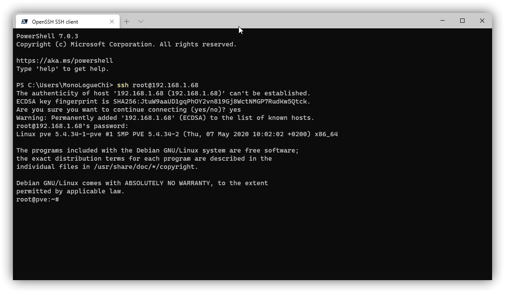

以下内容使用到了 vi 编辑器，vi 编辑器的使用方法请自行百度。

修改 grub 文件

```
vi /etc/default/grub
```

找到 `GRUB_CMDLINE_LINUX_DEFAULT="quiet"`，修改为 `GRUB_CMDLINE_LINUX_DEFAULT="quiet intel_iommu=on"`，amd 的话就改为 `GRUB_CMDLINE_LINUX_DEFAULT="quiet amd_iommu=on"`


然后保存，输入命令

```
update-grub
```

打开 `/etc/modules`

```
vi /etc/modules
```

增加以下内容

```
vfio
vfio_iommu_type1
vfio_pci
vfio_virqfd
```


保存，并**重启**服务器。

## 安装和配置爱快

### 准备镜像

安装爱快有两种方法，一种是直接使用 ISO 镜像安装，另一种是导入 IMG 镜像，由于使用 ISO 安装 64 位爱快，必须要有 4G 以上的内存，对于小内存机器并不友好，所以我打算使用第二种方法安装。

下载爱快的 IMG 镜像，然后用 DiskGenius 处理一下镜像，这个工具在我的网盘里也有下载。

首先创建一个空的磁盘镜像文件 `磁盘`->`新建虚拟磁盘文件`->`img格式`，大小选择 1G 就可以，如果你喜欢的话，可以搞更大。

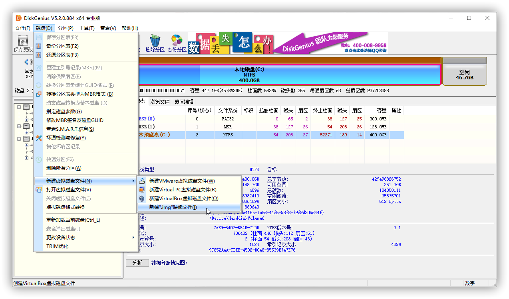

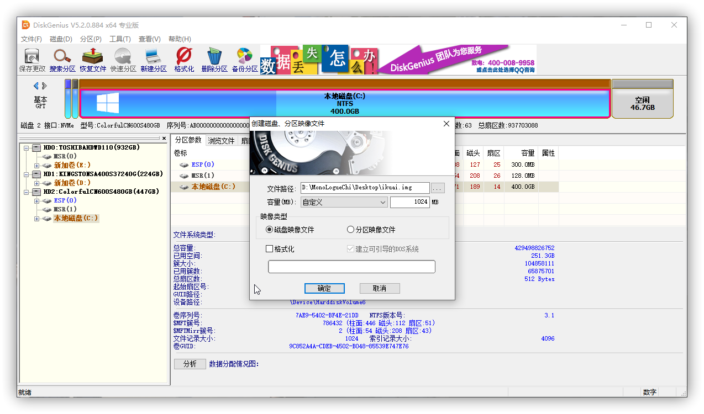

然后把下载好的爱快镜像也拖进来，使用 `工具`->`磁盘克隆` 功能，把爱快复制到这块新盘上面。

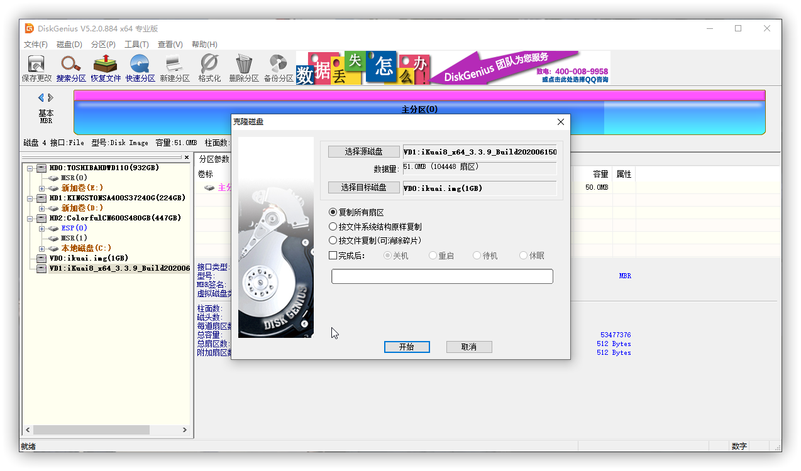

将新建的这块磁盘镜像上传到服务器上，我这里使用 SCP 工具，你也可以使用其他工具。

```
scp D:\MonoLogueChi\Desktop\ikuai.img root@192.168.1.68:~
```


### 创建虚拟机

然后创建虚拟机，这一步需要注意的几个点，硬盘选择 SATA 模式，硬盘大小无所谓，等下我们都是要删掉的。

CPU 的类别要选择你自己 CPU 对应的，如果实在不清楚，就选 KVM64（性能上会稍微差一点）或者 host（性能更强，但是兼容性较差）。

如果是用在生产环境，64 位固件推荐给 2G 或更高内存，我这里只是演示，就只给了 1G 内存。

网络那里现在只添加一个网桥的接口就可以。

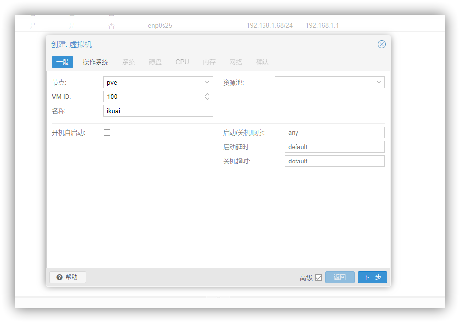


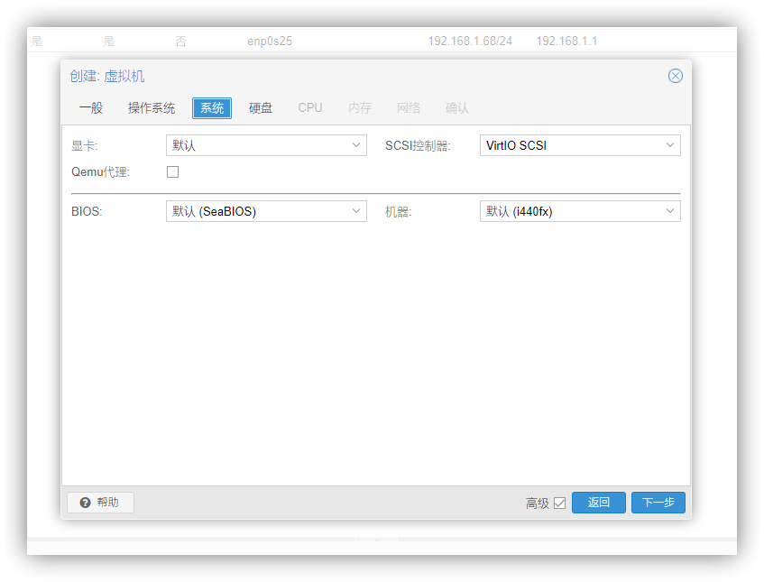


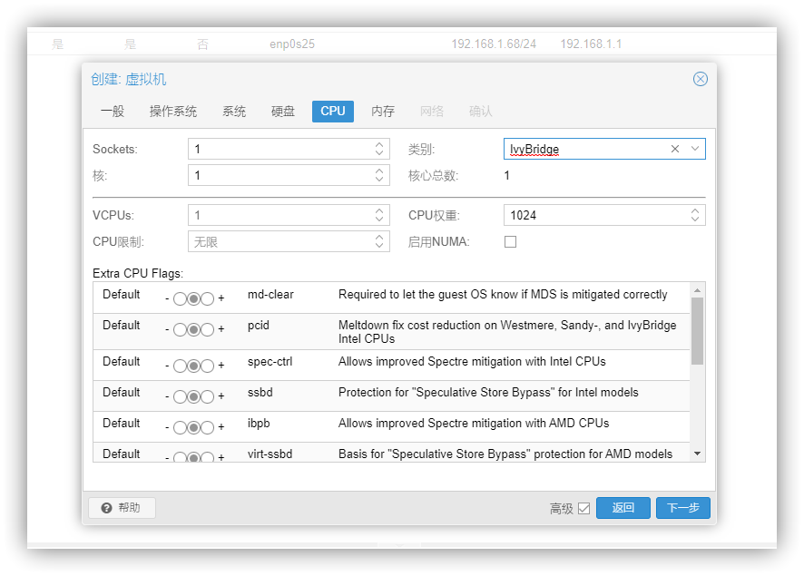


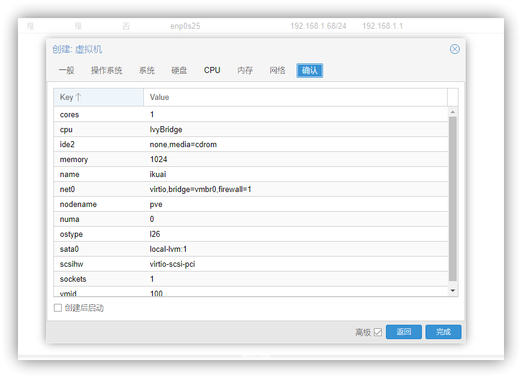

然后分离并且删除刚才创建的虚拟硬盘，也就是 sata0，一定要记得删除。

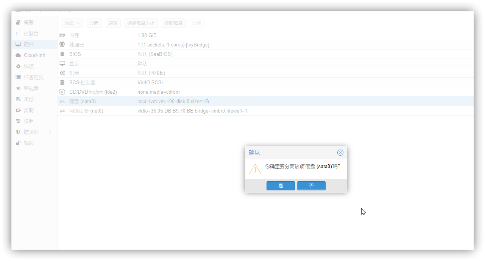

然后再使用 ssh 登录到 PVE，定位到刚才上传镜像的目录，然后将镜像导入到 PVE 中。

```
qm importdisk 100 ikuai.img local-lvm
```

其中 `100` 为虚拟机 ID，可以在控制台查看，`ikuai.img` 镜像路径，可以是相对路径，也可以是绝对路径 `local-lvm` 就不要改了。

然后回到浏览器里的管理后台，可以看到编号为 100 的爱快下面，多了一块未使用的磁盘 0，把这块磁盘加上去。


如果你前面选的不是 sata，或者是没有删除原有的磁盘，记得要到选项里面修改启动顺序。

完成上面的操作以后，我们就开机，爱快第一次启动会自动初始化硬盘，并且会自动重启一次，这个不要担心，慢慢等就好。等开机以后会看到如下图的一个东西，看到这个就证明已经安装成功了，我们先关机。

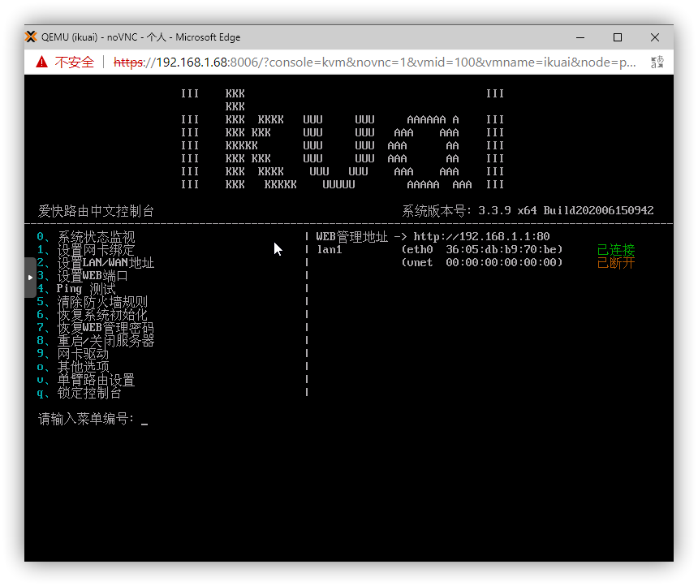

### 查找网卡 ID

#### 简单方法

输入命令

```
dmesg | grep eth
```

会输出

```
[    1.407753] e1000e 0000:00:19.0 eth0: (PCI Express:2.5GT/s:Width x1) bc:5f:f4:ab:d8:7b
[    1.407754] e1000e 0000:00:19.0 eth0: Intel(R) PRO/1000 Network Connection
[    1.407788] e1000e 0000:00:19.0 eth0: MAC: 10, PHY: 11, PBA No: FFFFFF-0FF
[    1.516131] e1000e 0000:02:00.0 eth1: (PCI Express:2.5GT/s:Width x1) bc:5f:f4:ab:d8:7c
[    1.516133] e1000e 0000:02:00.0 eth1: Intel(R) PRO/1000 Network Connection
[    1.516147] e1000e 0000:02:00.0 eth1: MAC: 4, PHY: 8, PBA No: FFFFFF-0FF
[    1.516934] e1000e 0000:00:19.0 enp0s25: renamed from eth0
[    1.529255] e1000e 0000:02:00.0 enp2s0: renamed from eth1
```

我们就知道了网卡 ID 和网卡的对应关系

- `enp0s25` - `eth0` - `00:19.0`
- `enp2s0` - `eth1` - `02:00.0`

#### 标准方法

先输入

```
ip addr
```

看到有输出

```
1: lo: <LOOPBACK,UP,LOWER_UP> mtu 65536 qdisc noqueue state UNKNOWN group default qlen 1000
    link/loopback 00:00:00:00:00:00 brd 00:00:00:00:00:00
    inet 127.0.0.1/8 scope host lo
       valid_lft forever preferred_lft forever
    inet6 ::1/128 scope host
       valid_lft forever preferred_lft forever
2: enp0s25: <BROADCAST,MULTICAST,UP,LOWER_UP> mtu 1500 qdisc pfifo_fast master vmbr0 state UP group default qlen 1000
    link/ether bc:5f:f4:ab:d8:7b brd ff:ff:ff:ff:ff:ff
3: enp2s0: <BROADCAST,MULTICAST> mtu 1500 qdisc noop state DOWN group default qlen 1000
    link/ether bc:5f:f4:ab:d8:7c brd ff:ff:ff:ff:ff:ff
4: vmbr0: <BROADCAST,MULTICAST,UP,LOWER_UP> mtu 1500 qdisc noqueue state UP group default qlen 1000
    link/ether bc:5f:f4:ab:d8:7b brd ff:ff:ff:ff:ff:ff
    inet 192.168.1.68/24 brd 192.168.1.255 scope global vmbr0
       valid_lft forever preferred_lft forever
    inet6 fe80::be5f:f4ff:feab:d87b/64 scope link
       valid_lft forever preferred_lft forever
```

可以判断得到，两张网卡的名称分别是 `enp0s25` 和 `enp2s0`，其实这一步也可以省略，因为在 PVE 的管理后台就能看到网卡的信息。

```
lspci |grep net
```

输出

```
00:19.0 Ethernet controller: Intel Corporation 82579LM Gigabit Network Connection (rev 04)
02:00.0 Ethernet controller: Intel Corporation 82583V Gigabit Network Connection
```

其中 `00:19.0` 和 `02:00.0` 就是网卡的 ID。

然后输入

```
dmesg | grep enp2s0
```

会输出

```
[    1.529255] e1000e 0000:02:00.0 enp2s0: renamed from eth1
```

我们指定 enp2s0 对应的是 eth1，接下来接着输入

```
dmesg | grep eth1
```

会输出

```
[    1.516131] e1000e 0000:02:00.0 eth1: (PCI Express:2.5GT/s:Width x1) bc:5f:f4:ab:d8:7c
[    1.516133] e1000e 0000:02:00.0 eth1: Intel(R) PRO/1000 Network Connection
[    1.516147] e1000e 0000:02:00.0 eth1: MAC: 4, PHY: 8, PBA No: FFFFFF-0FF
[    1.529255] e1000e 0000:02:00.0 enp2s0: renamed from eth1
```

到这里，我们就可以知道，有对应关系 `enp2s0` - `eth1` - `02:00.0`，另一张就是 `enp0s25` - `eth0` - `00:19.0`

### 设置 WAN 口直通

接下来回到后台，在 PVE 的网络选项卡里可以看到，网桥中的端口为 `enp0s25`，那我们需要直通的就是另一张网卡，也就是 `enp2s0`，ID 为 `02:00.0`


在爱快虚拟机下的 `硬件`->`添加`->`PCI设备`，然后在下拉菜单找到对应 ID 的设备。

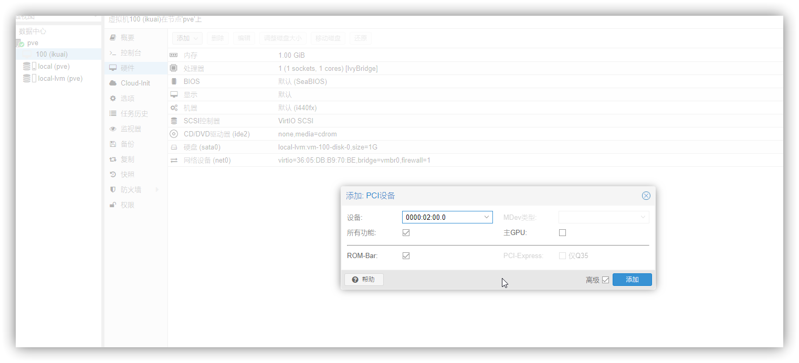

把 WAN 口插上网线，连接到原来的路由器，不要改变以前的网络设备，然后重新开机。

如果正常的话，可以看到 WAN 口和 LAN 口都是已连接。

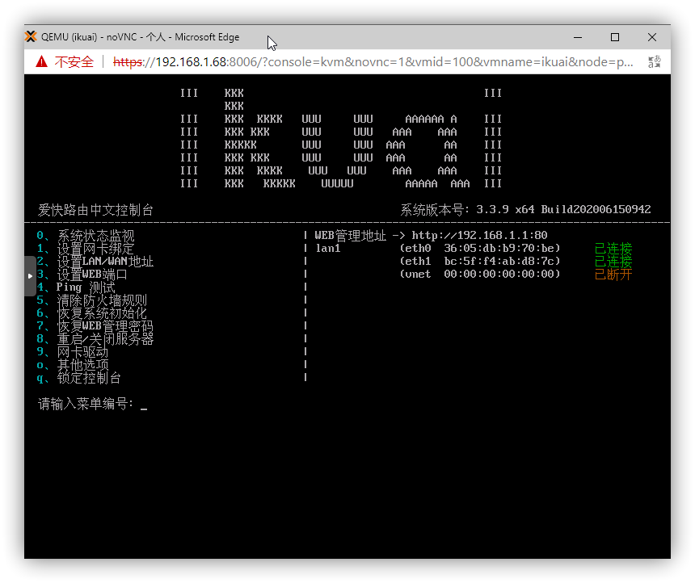

### 爱快设置

**以下内容均属于爱快使用的一部分，大家可以会简略一部分**

下面这一步不设置也可以，只是测试看一下爱快是否正常运行，不想做的直接跳到后面安装 OpenWRT 的这一步，在最后再去设置爱快。

到了这里，就需要修改一下网络了，把电脑和交换机断开，直接插到机器的 LAN 口，也就是最开始插网线的端口上（电脑和 PVE 虚拟机的 LAN 口直连）。然后把电脑网络修改为手动获取 IP（因为爱快默认没开 DHCP，如果是 OP 的话会自动获取 IP）。

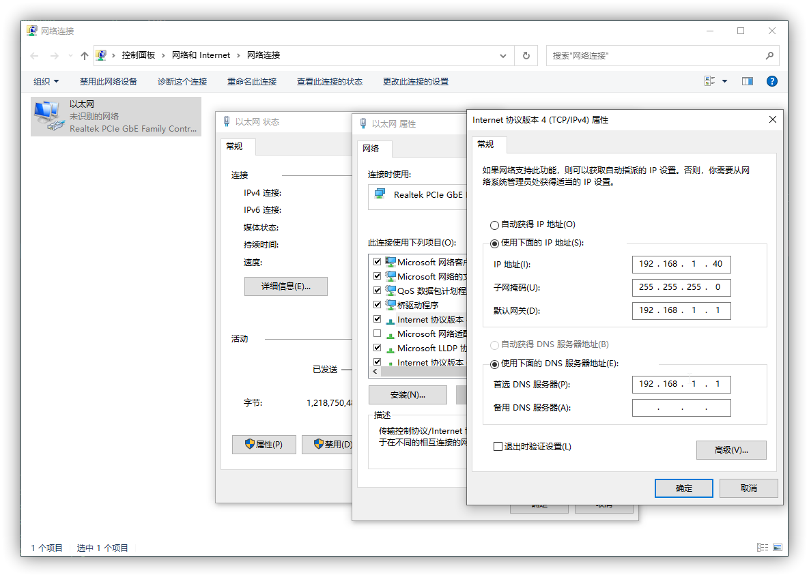

然后在浏览器打开 `192.168.1.1` 进入爱快后台，默认用户名和密码均为 `admin`。

设置外网，给 WAN 口绑定直通的那张网卡，然后先暂时选用 `DHCP`（这些都是临时的，等整机安装完了，怎么改随你，如果你真有能力一步到位就去搞，没有能力就按照教程走），设置完了记得点一下确定，别傻傻的等他转完圈。


至此，爱快就已经安装并且设置完成了，这里只是测试一下，测试完以后要将网线改回到初始的状态，电脑和 PVE 虚拟机的 LAN 口都接在同一交换机上。

## 安装和配置 OpenWRT

### 安装

和上面创建爱快虚拟机的步骤一样，创建一个 OpenWRT 虚拟机，只是不需要提前处理镜像，也不需要做直通网卡这一步了。还有有区别的就是，如果是使用 UEFI 启动的镜像，需要选择 BIOS 为 UEFI 启动的，如果是传统方式启动的，就和爱快设置一样。

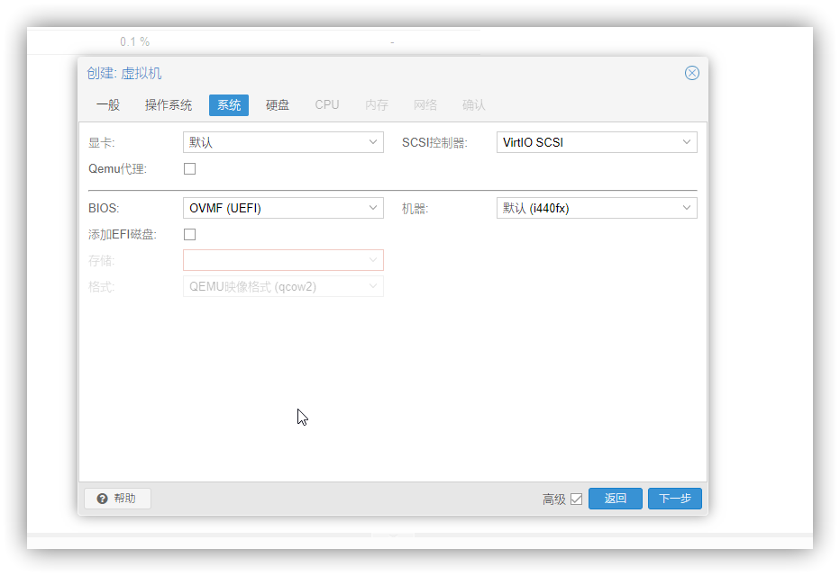

安装完成之后开机。

### 配置

我们需要将 OpenWRT 设置为旁路由，但是想要登录 OpenWRT 需要设置一下。

输入命令

```
ifconfig br-lan 192.168.1.2
```

然后在浏览器打开 `192.168.1.2`，就可以登录到 OpenWRT 的后台了。

再接下来修改 LAN 口，就按照旁路由的设置去修改。旁路由相关的文章，我在前几天写过，不懂的可以去翻一下（下面图片只是演示，具体要去看教程，有些需要在 DHCP 那里勾选上强制）。

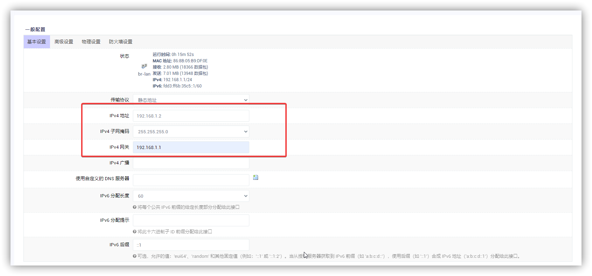

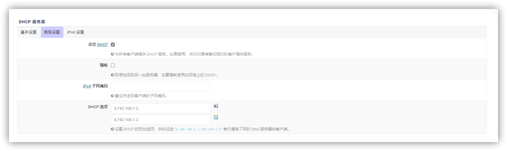

接下来还是测试，将电脑和虚拟机的 LAN 口直连，如果前面设置了手动设置 IP 和 DNS 就删掉，改成自动获取 IP 和 DNS。

过一会之后看一下效果

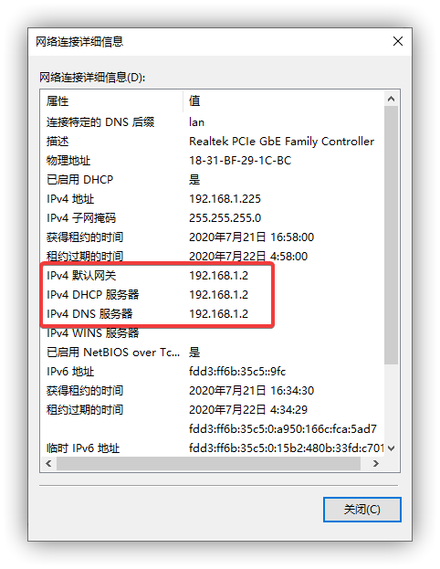

如图所示，网关和 DNS 服务器都指向旁路由，就说明设置成功了。

再接下来主路由爱快和旁路由 OpenWRT 的设置就不需要我教了，大家可以发挥所长，打造自己的网络环境了，如果还是太多的内容不会的话，可以翻一翻其他的文章，多学习。

## 安装 NAS

安装 NAS 系统的话，就在下一篇文章再来吧，这一篇已经够长了。
