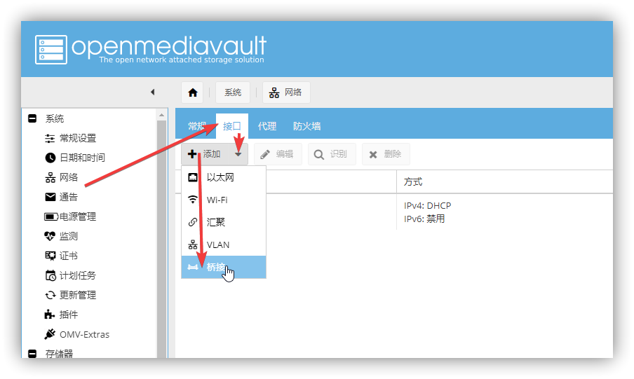
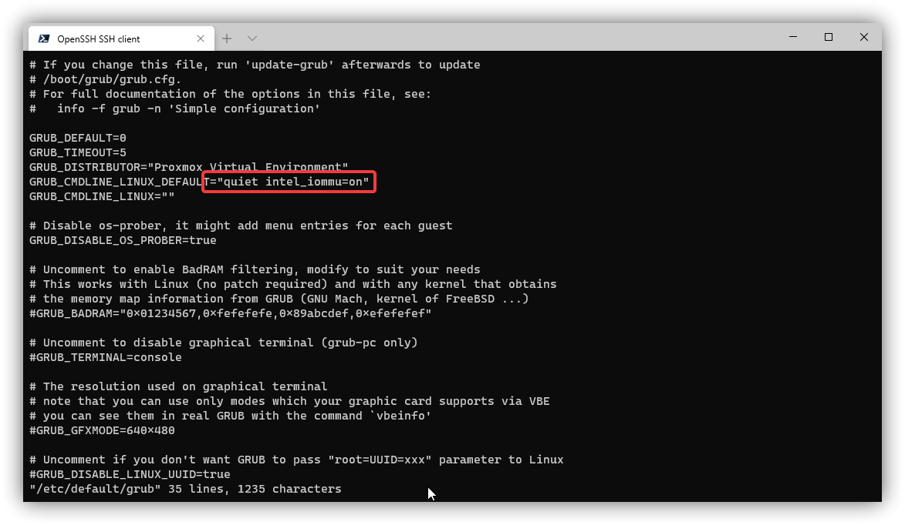
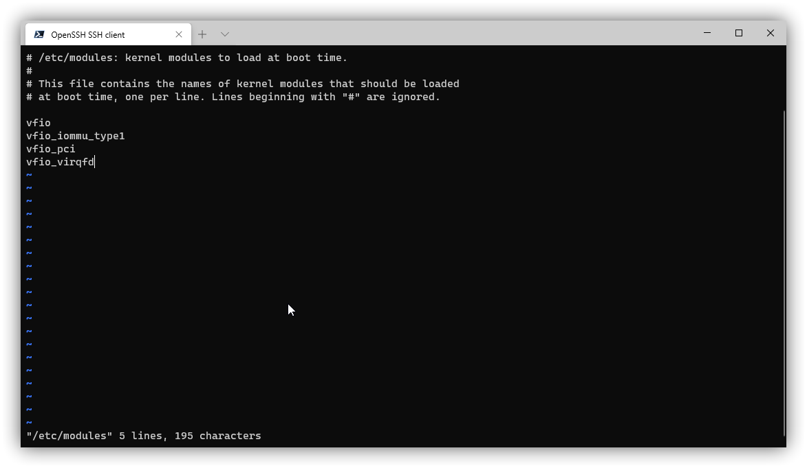
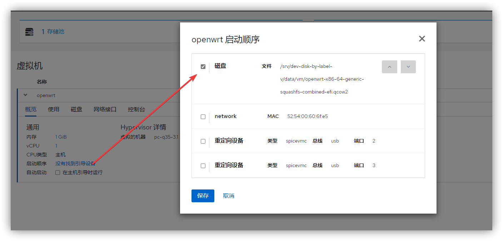
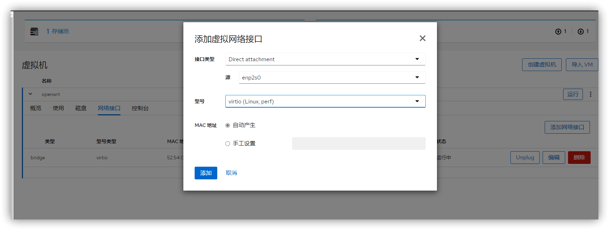

在 OMV (Debian) 上安装软路由虚拟机，并且网卡直通给虚拟机。

<!-- more -->

本文适用于 OMV5 ，演示版本为 5.5.8-1，其他版本是否适用，请自行判定。

这篇教程很复杂，不懂的可以看我以前写的教程，或者是到网上自己爬。

在前面一段时间，我写过一篇教程，讲的是在 PVE 上安装虚拟机组装 All In One，但是那一期并不完美，只把硬盘直通给了 OMV，而没有直通显卡，这样 OMV 并没有硬件解码的能力。

看网上大部分 Up 主的方案，都是创建 PVE 虚拟机，然后虚拟机上装 NAS，然后把 SATA 控制器和核显直通给 NAS，我就在想，为什么不直接在 NAS 上安装软路由虚拟机，然后再把网卡直通给软路由？

## 准备

有想法就开搞，看几个常见的 NAS 系统，Synology，FreeNAS，OpenMediaVault。

这三个系统中，首先把 FreeNAS 排除，基于 FreeBSD 的系统，搞不定，然后是 Synology，白的教程我可以出，黑的是不可能的，但是白的那台我不会瞎折腾的。系统就敲定是 OpenMediaVault，基于 Debian，贼方便。

安装系统就略过了，这个网上有很多的教程，不过大部分 OMV 都是安装在单盘上的，如果想安装在 Raid 上，只需要一点技巧，这个以后可能会出一期教程的。

## 安装拓展插件和内核

安装完 OMV 之后先更新系统

```
sudo apt update
sudo apt dist-upgrade
```

然后安装[拓展插件](https://github.com/OpenMediaVault-Plugin-Developers/installScript)

```
wget -O - https://github.com/OpenMediaVault-Plugin-Developers/installScript/raw/master/install | sudo bash
```

安装完拓展插件以后，刷新网页，会有`OMV-Extras`这个选项，在内核选项卡中安装 PVE 内核，并设为默认启动内核。


然后重启系统，使用 PVE 内核启动。

## 安装 KVM 和 Cockpit

接下来安装虚拟机，首先安装 `Cockpit`，这个直接在 OMV 的面板上安装即可（这一步也可以不做，直接使用下面的命令行安装）


然后安装 KVM 虚拟机相关的东西（如果不懂，直接照抄就行）

```
sudo apt install cockpit cockpit-* qemu qemu-kvm qemu-utils libvirt-* bridge-utils virt-* net-tools
```

尝试打开 Cockpit 面板看一下可设置的内容。

## 创建网桥

如果你有多个网口想要作为 LAN 口，就需要把这些网卡桥接起来，作为一个网桥使用，在 OMV 里创建网桥非常简单，只要你做了上面的操作，就可以在 OMV 管理面板创建网桥了，注意 OMV5 的网络配置文件，和正常 Debian 的不一样，尽量不要直接修改配置文件。

创建网桥的过程中，当前连接的网口是不能被选择的，可以把这个网口留作后面要用的直通 WAN 口。



创建完网桥之后，需要把网桥添加进 kvm 虚拟机里。

```
sudo apt install vim

vim ~/br0.xml
```

添加下面内容，注意 name，我的是 br0，你的不知道是不是。

```xml
<network>
 <name>br0</name>
 <forward mode="bridge"/>
 <bridge name='br0'/>
</network>
```

然后添加进 kvm 虚拟机里

```
sudo virsh net-define --file ~/br0.xml
sudo virsh net-start br0
```

然后就可以在 Cockpit 面板里看到这个网络了。


## 配置硬件直通

这里参考PVE虚拟机那一节

修改 grub 文件

```
sudo vim /etc/default/grub
```

找到 `GRUB_CMDLINE_LINUX_DEFAULT="quiet"`，修改为 `GRUB_CMDLINE_LINUX_DEFAULT="quiet intel_iommu=on"`，amd 的话就改为 `GRUB_CMDLINE_LINUX_DEFAULT="quiet amd_iommu=on"`



然后保存，输入命令

```
sudo update-grub
```

打开 `/etc/modules`

```
sudo vim /etc/modules
```

增加以下内容

```
vfio
vfio_iommu_type1
vfio_pci
vfio_virqfd
```



保存，并**重启**服务器。

## 创建虚拟机

如果你是多网口的机器，并且刚才创建了网桥，创建虚拟机之前，我们要先改一下网线接口的位置，将网线从刚才的网口，改到创建好网桥的网口上。

首先我们创建一个存储池，在Cockpit面板里操作即可，创建完成后记得激活。


然后上传镜像到此存储池中，在电脑上用SCP上传（不是NAS上）

```
scp D:\MonoLogueChi\Desktop\1\openwrt-x86-64-generic-squashfs-combined-efi.qcow2 root@192.168.1.129:/srv/dev-disk-by-label-v/data/vm
```

如果你不知用什么镜像，可以用我编译的[精简版镜像](https://dl.u2sb.top/#/s/GPIQ?path=%2Fblog%2F%E8%BD%AF%E8%B7%AF%E7%94%B1%2FOpenWRT%2F%E8%87%AA%E5%B7%B1%E7%BC%96%E8%AF%91%E7%9A%84%E9%95%9C%E5%83%8F%2F%E7%B2%BE%E7%AE%80%E5%9B%BA%E4%BB%B6)

然后导入虚拟机，但不要立即启动，修改启动顺序，然后检查一下当前的网络接口是不是br0，如果是br0，就启动测试一下。



看一下网卡是不是正常的。


## 硬件直通

### 可以PCIE直通

测试完之后虚拟机关机，然后搞硬件直通。

下面这一步，最好打开一个记事本，把需要记录的都粘贴进去。

首先是看网卡的id，这一部分可以参考我们上一期的PVE教程。

```
sudo dmesg | grep eth
```

会输出大概这么一长串东西

```
[    1.294563] e1000e 0000:00:19.0 eth0: (PCI Express:2.5GT/s:Width x1) bc:5f:f4:ab:d8:7b
[    1.294564] e1000e 0000:00:19.0 eth0: Intel(R) PRO/1000 Network Connection
[    1.294597] e1000e 0000:00:19.0 eth0: MAC: 10, PHY: 11, PBA No: FFFFFF-0FF
[    1.405764] e1000e 0000:04:00.0 eth1: (PCI Express:2.5GT/s:Width x1) bc:5f:f4:ab:d8:7c
[    1.405765] e1000e 0000:04:00.0 eth1: Intel(R) PRO/1000 Network Connection
[    1.405787] e1000e 0000:04:00.0 eth1: MAC: 4, PHY: 8, PBA No: FFFFFF-0FF
[    1.407947] e1000e 0000:00:19.0 enp0s25: renamed from eth0
[    1.496268] e1000e 0000:04:00.0 enp4s0: renamed from eth1
[    1.552373] r8125 0000:01:00.0 enp1s0: renamed from eth0
[    6.041822] e1000e 0000:04:00.0 eth0: (PCI Express:2.5GT/s:Width x1) bc:5f:f4:ab:d8:7c
[    6.041824] e1000e 0000:04:00.0 eth0: Intel(R) PRO/1000 Network Connection
[    6.041838] e1000e 0000:04:00.0 eth0: MAC: 4, PHY: 8, PBA No: FFFFFF-0FF
[    6.043005] e1000e 0000:04:00.0 enp4s0: renamed from eth0
[ 5406.455848] e1000e 0000:04:00.0 eth0: (PCI Express:2.5GT/s:Width x1) bc:5f:f4:ab:d8:7c
[ 5406.455850] e1000e 0000:04:00.0 eth0: Intel(R) PRO/1000 Network Connection
[ 5406.455864] e1000e 0000:04:00.0 eth0: MAC: 4, PHY: 8, PBA No: FFFFFF-0FF
[ 5406.457045] e1000e 0000:04:00.0 enp4s0: renamed from eth0
```

我想要直通的网卡是 `enp4s0`，我找到了相关的ID

```
0000:04:00.0
```

那这个有啥用呢？再来看下面的（如果不是新手，下面这一部分其实不用做）

```
virsh nodedev-list --tree |grep pci
```

会输出一个这样的东西

```
  +- pci_0000_00_00_0
  +- pci_0000_00_01_0
  |   +- pci_0000_01_00_0
  +- pci_0000_00_02_0
  +- pci_0000_00_14_0
  +- pci_0000_00_16_0
  +- pci_0000_00_16_3
  +- pci_0000_00_19_0
  +- pci_0000_00_1a_0
  +- pci_0000_00_1b_0
  +- pci_0000_00_1c_0
  +- pci_0000_00_1c_2
  |   +- pci_0000_03_00_0
  +- pci_0000_00_1c_4
  |   +- pci_0000_04_00_0
  +- pci_0000_00_1d_0
  +- pci_0000_00_1f_0
  +- pci_0000_00_1f_2
  +- pci_0000_00_1f_3
```

在里面找到 `pci_0000_04_00_0` ，就是前面我们找到的网卡，别着急，接着看。

输入命令

```
virsh nodedev-dumpxml pci_0000_04_00_0
```

会输出这样的一堆东西

```xml
<device>
  <name>pci_0000_04_00_0</name>
  <path>/sys/devices/pci0000:00/0000:00:1c.4/0000:04:00.0</path>
  <parent>pci_0000_00_1c_4</parent>
  <driver>
    <name>vfio-pci</name>
  </driver>
  <capability type='pci'>
    <domain>0</domain>
    <bus>4</bus>
    <slot>0</slot>
    <function>0</function>
    <product id='0x150c'>82583V Gigabit Network Connection</product>
    <vendor id='0x8086'>Intel Corporation</vendor>
    <iommuGroup number='14'>
      <address domain='0x0000' bus='0x04' slot='0x00' function='0x0'/>
    </iommuGroup>
    <pci-express>
      <link validity='cap' port='0' speed='2.5' width='1'/>
      <link validity='sta' speed='2.5' width='1'/>
    </pci-express>
  </capability>
</device>
```

上面这些最好记在一个地方，方便等下查看。


接着detach设备

```
virsh nodedev-dettach pci_0000_04_00_0
```

然后编辑虚拟机配置文件，具体名称看你刚才设置的

```
vim /etc/libvirt/qemu/openwrt.xml
```

添加一部分

```xml
<devices>
......
  <hostdev mode='subsystem' type='pci' managed='yes'>
   <source>
     <address domain='0x0000' bus='0x04' slot='0x00' function='0x0'/>
   </source>
  </hostdev>
......
</devices>
```

其中的 `<address domain='0x0000' bus='0x04' slot='0x00' function='0x0'/>`，这一部分按照上面的填。

添加完成之后，保存，然后重启主机，再打开虚拟机，看一下是否有另一张网卡。

### 不能硬件直通

如果你的网卡是那种螃蟹卡，不能pcie直通，就按照下面的来做。

在虚拟机这里再添加一张网卡



这样虽然也能用，但是效率肯定没有硬件直通高。

开机，输入 `ifconfig -a` 查看另一张网卡是否存在。

## 设置

接下来就是正常软路由的设置了，因为前面开机过一次，可能会遇到没有WAN口的情况，遇到这种情况，手动创建一个WAN口就可以了。


## 补充

貌似按照上面操作，OMV上的DNS会被NetworkManager接管，导致DNS配置出现问题。这个可以通过修改NetworkManager配置文件解决

```
vim /etc/NetworkManager/NetworkManager.conf
```

修改

```
[main]
dns=none
no-auto-default=*
```
---

参考

> KVM 安装部分 https://zhuanlan.zhihu.com/p/113187354
> 硬件直通部分 https://libvirt.org/formatdomain.html
