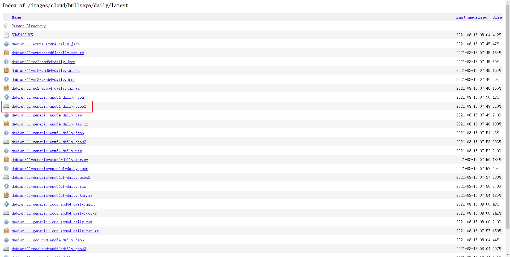

以前写过一篇关于[腾讯云使用自定义镜像](/2019/custom-mirror.html)的文章，但是那片文章真的是使用自定义镜像，如果是使用原版镜像的话，用那种方法有些麻烦，这里就写一种简单一点的方法。

<!-- more -->

## 文档

首先先看一下腾讯云的[官方文档](https://cloud.tencent.com/document/product/213/4942)。如果是不太熟悉虚拟化的朋友读下来，可能就是感觉云里雾里，不知道在讲什么。下面我就用一种很简单的方法去操作一边，演示怎么使用自定义的镜像。

## 创建快照

数据才是最重要的，使用自定义镜像装系统之前一定要创建快照。这一步你可以在后面制作完镜像以后再去做，但是重装系统之前一定要做。

## 基本要求

还是看文档，确定一下基本要求，要满足这些要求才可以正常制作镜像。

## 下载镜像

我们需要下载一个合适的镜像，打开 [Debian](https://www.debian.org/) 官网，在 [获取 Debian](https://www.debian.org/distrib/)中可以找到，使用 Debian 云映像，比如说我需要最新的 Debian11 镜像，就可以在里面下载到，格式选择 qcow2 即可。

### 导入自定义镜像

按照[官方文档](https://cloud.tencent.com/document/product/213/4945#.E5.AF.BC.E5.85.A5.E6.AD.A5.E9.AA.A4)给出的导入步骤，一部一部走下来就可以了。

记住上传的文件一定要有`公有读`权限。

我暂时不能确定是否是必须上传的`OOS`上，其他的链接没有尝试过，如果有大佬愿意尝试的话，可以试一下上传到其他服务器，看看分享出来的链接能不能用。

## 安装系统

这一步没啥说的，常规操作，记得一定要先创建快照，一定要先做好备份。

装完系统以后，按照 [说明](https://mirrors.cloud.tencent.com/) 改一下软件源，内网访问更快更省流量。
