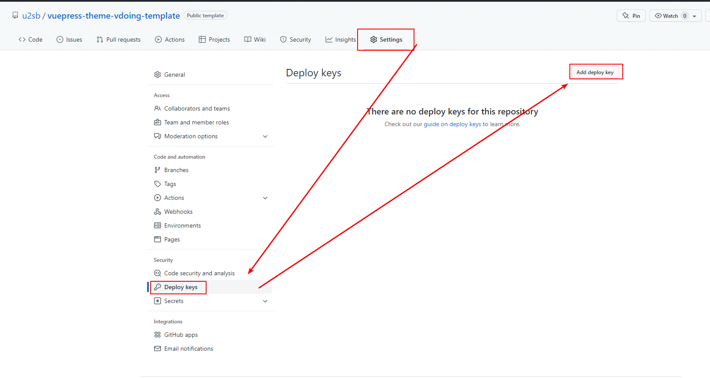
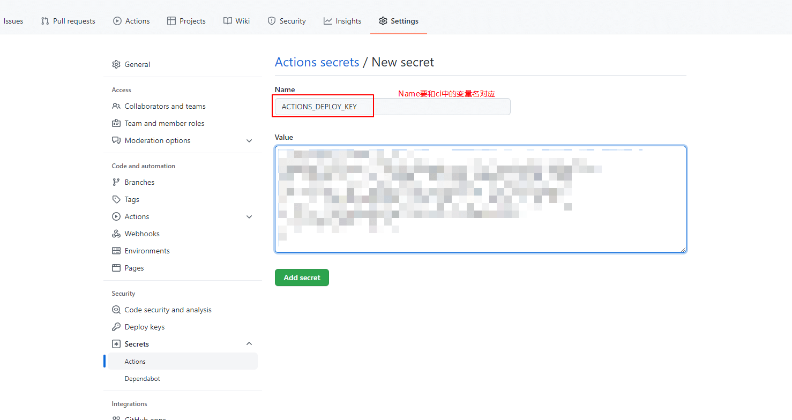

使用 GitHub Actions CI 将博客部署到 GitHub。

<!-- more -->

网上有很多文章，但是我仍要重新写一遍。

> 这东西别迷信什么权威，正所谓猫有猫道，狗有狗道，每个人的习惯不一样，做法也不一样，但最后的效果都差不多。别看谁和谁说的不一样，就认为一定有一个错的。

## 生成 ssh 密钥对

win10 和 win11 系统可以直接使用 powershell，Linux 和 Mac OS 也可以直接使用，其他系统请自行想办法解决。

使用以下命令生成密钥对[^ssh-key]

```bash
ssh-keygen -t ed25519 -C "youer@mail.com" -f ./key.txt
```

其中参数有：

- `-C` : 注释
- `-f` : 文件

然后会让你输入密码，我们不需要密码，直接按回车即可。

然后就可以在你打开 powershell 的地方找到 `key.txt` 和 `key.txt.pub` 两个文件，将 `key.txt.pub` 重命名为 `key.txt.pub.txt`，方便打开。

## 为仓库添加公钥

打开 GitHub 仓库的 `Settings` - `Deploy keys`，添加公钥，内容就是前面生成的 `key.txt.pub.txt` 的内容。下面的 `Allow write access` 一定要勾选[^deploy-keys]。

注意是仓库的设置，不是账户的设置。




## 添加私钥到 Actions Secrets

打开 GitHub 仓库的 `Settings` - `Secrets` - `Actions`，添加 `repository secrets`，内容就是前面生成的 `key.txt` 的内容[^secrets]。

注意 Name 要和 `CI` 中的变量对应。




## 编辑 CI 文件

```yml
# .github/workflows/deploy.yml

name: deploy

# 在main分支发生push事件时触发。
on:
  push:
    branches:
      - main

env: # 设置环境变量
  TZ: Asia/Shanghai # 时区（设置时区可使页面中的`最近更新时间`使用时区时间）

jobs:
  build:
    runs-on: ubuntu-latest # 运行在虚拟机环境ubuntu-latest

    steps:
      # 检出
      - name: Checkout
        uses: actions/checkout@v2

        # 安装 node
      - name: Setup Node
        uses: actions/setup-node@v3
        with:
          node-version: "16.x"
          registry-url: "https://registry.npmjs.org"
          cache: "yarn"

        # 构建
      - name: Build
        run: |
          yarn install
          yarn build

      # 发布到 gh-page 分支
      - name: Deploy github
        uses: peaceiris/actions-gh-pages@v3
        with:
          publish_dir: ./dist
          deploy_key: ${{ secrets.ACTIONS_DEPLOY_KEY }}
          user_name: "github-actions[bot]"
          user_email: "github-actions[bot]@users.noreply.github.com"
```

## 测试

推送到 GitHub 测试。

## 注意事项

生成的密钥对文件，一定要销毁，不要保存，这东西存着非但没用，反而是隐患。

## 参考

[^ssh-key]: [Generating a new SSH key and adding it to the ssh-agent](https://docs.github.com/en/authentication/connecting-to-github-with-ssh/generating-a-new-ssh-key-and-adding-it-to-the-ssh-agent)
[^deploy-keys]: [Managing deploy keys](https://docs.github.com/en/developers/overview/managing-deploy-keys#deploy-keys)
[^secrets]: [Encrypted secrets](https://docs.github.com/en/actions/security-guides/encrypted-secrets)
