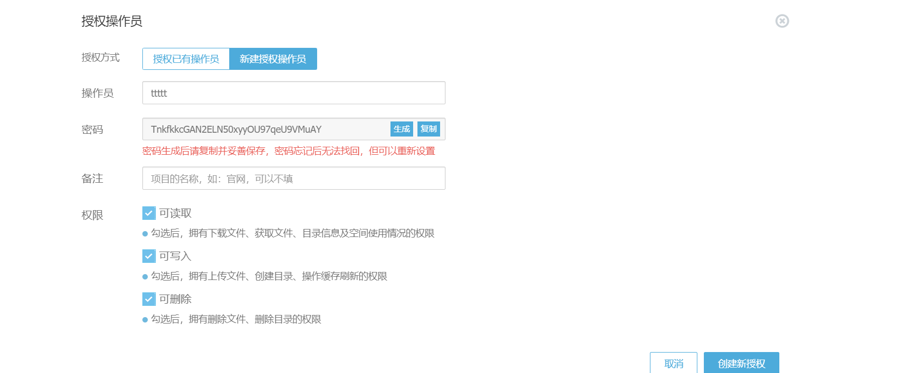

使用 GitHub Actions CI 将博客部署到又拍云。

<!-- more -->

网上文章不多，我就自己写一遍。

> 这东西别迷信什么权威，正所谓猫有猫道，狗有狗道，每个人的习惯不一样，做法也不一样，但最后的效果都差不多。别看谁和谁说的不一样，就认为一定有一个错的。

## 创建操作员

在云存储仓库可以正常使用的情况下，在 `存储管理` 的最后面找到 `操作员授权` 新建一个操作员[^关于操作员]




记录下操作员账号和密码。

## 添加密钥

参考 [添加私钥到 Actions Secrets](./03090.使用CI将博客部署到GitHub.md#添加私钥到-actions-secrets)，添加

- UP_BUCKET : 存储服务名称
- UP_OPERATOR : 操作员
- UP_OPERATOR_PASSWORD : 操作员密码

## 编辑 CI 文件

```yml
# .github/workflows/deploy.yml

name: deploy

# 在main分支发生push事件时触发。
on:
  push:
    branches:
      - main

env: # 设置环境变量
  TZ: Asia/Shanghai # 时区（设置时区可使页面中的`最近更新时间`使用时区时间）

jobs:
  build:
    runs-on: ubuntu-latest # 运行在虚拟机环境ubuntu-latest

    steps:
      # 检出
      - name: Checkout
        uses: actions/checkout@v2

        # 安装 node
      - name: Setup Node
        uses: actions/setup-node@v3
        with:
          node-version: "16.x"
          registry-url: "https://registry.npmjs.org"
          cache: "yarn"

        # 构建
      - name: Build
        run: |
          yarn install
          yarn build

        # 同步到又拍云
      - name: Deploy upyun
        run: |
          wget -O upx.tar.gz http://collection.b0.upaiyun.com/softwares/upx/upx_0.3.6_linux_x86_64.tar.gz
          tar -zxf upx.tar.gz
          chmod +x upx
          ./upx login ${{ secrets.UP_BUCKET }} ${{ secrets.UP_OPERATOR }} ${{ secrets.UP_OPERATOR_PASSWORD }}
          ./upx sync dist/ / --delete
          ./upx logout
```

## 测试

推送到 GitHub，等待 CI 执行完成，观察又拍云仓库文件变化，测试网页是否更新。

## 注意事项

请勿保存操作员密码，这东西留着没用，反而是隐患，正确的做法应该是，单独使用一个操作员，重新配置时忘记密码就直接换新的操作员。

## 参考

[^关于操作员]: [关于操作员的使用说明](https://help.upyun.com/knowledge-base/cdn-operator/)
