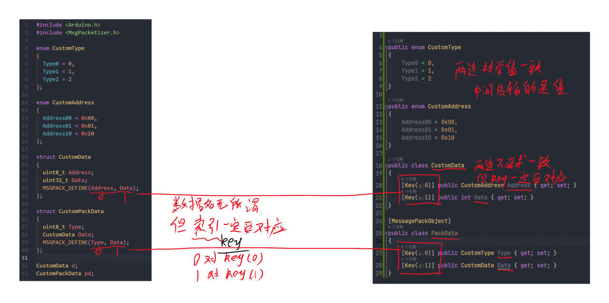

最近在做一个项目，涉及到到使用 Arduino 和上位机通信的问题，感觉网上的资料都不太合适，就自己撸一点东西出来。

主要包括 MessagePack，COBS，CRC 校验。

<!-- more -->

## 相关库

### 下位机

Arduino 编写下位机程序，需要的库包括：

- [MsgPacketizer](https://github.com/hideakitai/MsgPacketizer)

### 上位机

C# 编写上位机程序，需要的库包括：

- [MessagePack-CSharp](https://github.com/neuecc/MessagePack-CSharp)
- [COBS](https://github.com/LudwigThePig/COBS-in-C-Sharp/blob/master/COBS.cs)
- [CheckSum.CRC](https://github.com/AJ-comp/Algorithm)

## 原理解释

### 通信过程


### 数据编码与解析



## 简单示例

### 下位机

```c
#include <Arduino.h>
#include <MsgPacketizer.h>

enum CustomType
{
  Type0 = 0,
  Type1 = 1,
  Type2 = 2
};

enum CustomAddress
{
  Address00 = 0x00,
  Address01 = 0x01,
  Address10 = 0x10
};

struct CustomData
{
  uint8_t Address;
  uint32_t Data;
  MSGPACK_DEFINE(Address, Data);
};

struct CustomPackData
{
  uint8_t Type;
  CustomData Data;
  MSGPACK_DEFINE(Type, Data);
};

CustomData d;
CustomPackData pd;

byte send_index = 0x00;

void setup()
{
  Serial.begin(115200);
  delay(2000);

  d.Address = Address00;
  d.Data = 1024;
  pd.Type = Type1;
  pd.Data = d;

  MsgPacketizer::publish(Serial, send_index, pd)
      ->setFrameRate(1.f);
}

void loop()
{
  MsgPacketizer::update();
}
```

### 上位机

```cs
using System.Text.Json;
using Algorithm.Check;
using MessagePack;
using msgpack_tt.Models;
using msgpack_tt.Utils;

var sp = SerialPortHelp.Instance;

byte sendIndex = 0x00;
byte recvIndex = 0x00;

sp.OnDataReceived += bytes =>
{
    var d = COBS.Decode(bytes);
    if (d[0] != recvIndex || d.Last() != d.SkipLast(1).CRC8()) return;
    var mp = d.Skip(1).SkipLast(1).ToArray();
    var data = MessagePackSerializer.Deserialize<PackData>(mp);
    if (data == null) return;
    var json = JsonSerializer.Serialize(data);
    Console.WriteLine(json);
};

sp.Init("COM9", 115200);
sp.Open();


Console.ReadKey();
```

### 运行效果


## 双向通信

### 下位机

```c
#include <Arduino.h>
#include <MsgPacketizer.h>
#include <U8g2lib.h>
#include <Wire.h>

U8G2_SSD1306_128X64_NONAME_F_HW_I2C u8g2(U8G2_R0, /* reset=*/U8X8_PIN_NONE);

enum CustomType
{
  Type0 = 0,
  Type1 = 1,
  Type2 = 2
};

enum CustomAddress
{
  Address00 = 0x00,
  Address01 = 0x01,
  Address10 = 0x10
};

struct CustomData
{
  uint8_t Address;
  uint32_t Data;
  MSGPACK_DEFINE(Address, Data);
};

struct CustomPackData
{
  uint8_t Type;
  CustomData Data;
  MSGPACK_DEFINE(Type, Data);
};

CustomData d;
CustomPackData pd;

byte send_index = 0x00;
byte recv_index = 0x00;

void Reu8g2(CustomPackData p)
{
  u8g2.clearBuffer();
  u8g2.setCursor(0, 15);
  u8g2.print("指令:");
  u8g2.setCursor(0, 35);
  u8g2.print("地址:");
  u8g2.setCursor(0, 55);
  u8g2.print("数据:");

  u8g2.setCursor(64, 15);
  u8g2.print(p.Type);
  u8g2.setCursor(64, 35);
  u8g2.print(p.Data.Address);
  u8g2.setCursor(64, 55);
  u8g2.print(p.Data.Data);

  u8g2.sendBuffer();
}

void setup()
{
  Serial.begin(115200);
  delay(2000);

  u8g2.begin();
  u8g2.enableUTF8Print();
  u8g2.setFont(u8g2_font_unifont_t_chinese3);
  u8g2.setFontDirection(0);

  MsgPacketizer::subscribe(Serial, recv_index,
                           [&](const CustomPackData &p)
                           {
                             switch (p.Type)
                             {
                             case Type2:
                               Reu8g2(p);
                               break;
                             default:
                               break;
                             }
                           });

  d.Address = Address00;
  d.Data = 1024;
  pd.Type = Type1;
  pd.Data = d;

  MsgPacketizer::publish(Serial, send_index, pd)
      ->setFrameRate(1.f);
}

void loop()
{
  MsgPacketizer::update();
}
```

### 上位机

```cs
using System.Text.Json;
using Algorithm.Check;
using MessagePack;
using msgpack_tt.Models;
using msgpack_tt.Utils;

var sp = SerialPortHelp.Instance;

byte sendIndex = 0x00;
byte recvIndex = 0x00;

var sendData = new Queue<byte>();

sp.OnDataReceived += bytes =>
{
    var d = COBS.Decode(bytes);
    if (d[0] != recvIndex || d.Last() != d.SkipLast(1).CRC8()) return;
    var mp = d.Skip(1).SkipLast(1).ToArray();
    var data = MessagePackSerializer.Deserialize<PackData>(mp);
    if (data == null) return;
    var json = JsonSerializer.Serialize(data);
    Console.WriteLine(json);


    var d0 = new PackData
    {
        Type = CustomType.Type2,
        Data = new CustomData
        {
            Address = CustomAddress.Address10,
            Data = new Random().Next(0, 4096)
        }
    };

    var d1 = MessagePackSerializer.Serialize(d0);
    var d2 = new[] { sendIndex }.Concat(d1);
    var d3 = d2.WithCRC8(ExtensionForCRC8.CRC8Type.Basic);
    var d4 = COBS.Encode(d3.ToArray(), true);
    sp.Send(d4);
};

sp.Init("COM9");
sp.Open();

Console.ReadKey();
```

### 运行效果


## 示例代码

[https://github.com/MonoLogueChi/arduino-use-msgpack](https://github.com/MonoLogueChi/arduino-use-msgpack)
