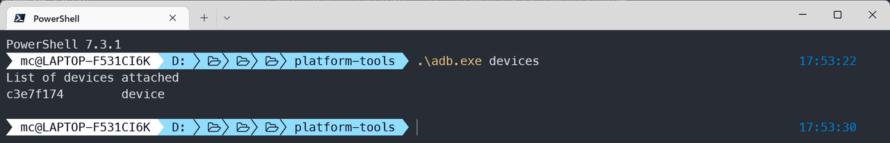
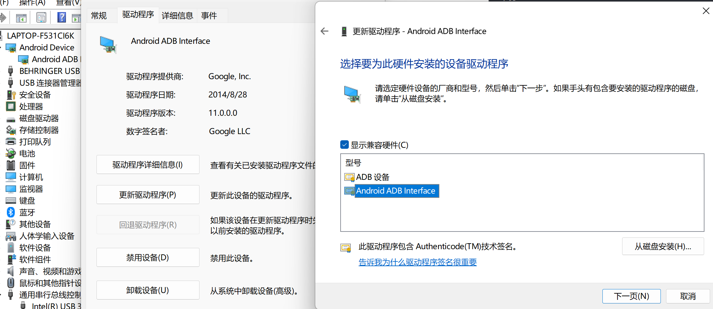
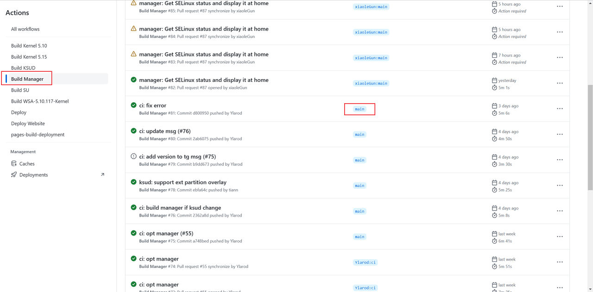
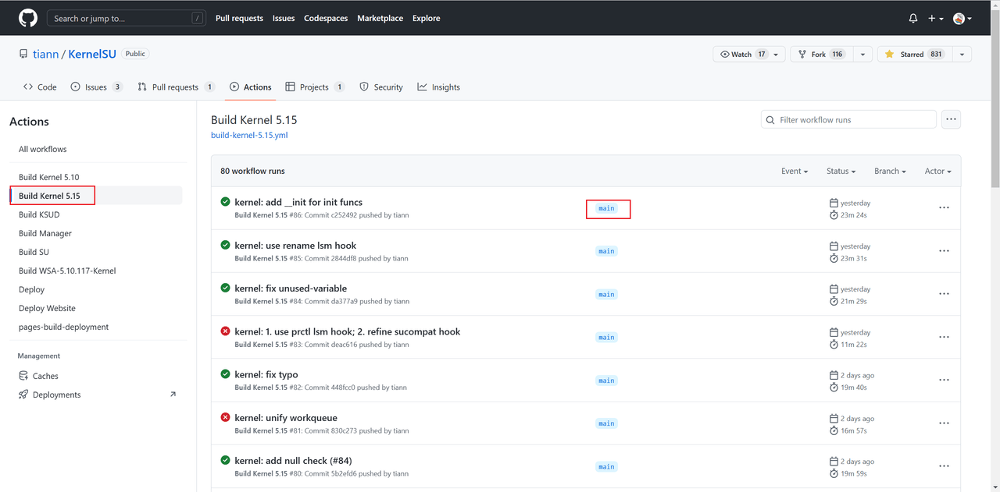

最近新买了小米 13，上周解锁了，最近看到网上比较火的 KernelSU，就打算搞上折腾一下。

<!-- more -->

博客里难得一见的老本行文章，关于搞机的。

:::tip
[KernelSU](https://kernelsu.org/) 更新速度比较快，本文一些内容可能会很快的失效，请将本文看作一篇刷机的参考文章即可，不要盲目迷信本文内容。
:::

这个教程真的太简单了，我都在怀疑有没有写这篇文章的必要性。

## 视频教程

<BiliBili bvid="BV1rv4y1r75X" />

## 准备工作

### 需要的基本素质

开始之前，一定要对刷机有一定了解，知道一些原理，知道怎么救砖，明确知道自己的目的是啥，否则请直接关掉本文，不要继续看了。

此外，还需要一定的阅读理解能力，我说解压你就一定要解压，我说放在哪里你就放在哪里，不按我说的做也可以，前提是你理解自己在做什么，按自己的步骤做，需要把命令转换为自己的。

### 解锁 Bootloader

如已解锁，请跳过此步骤。

详情请看 [申请解锁](https://www.miui.com/unlock/index.html)

### 获得原版 boot.img

用于恢复，非必须，但建议提前准备好，方便救砖，有多种方法可以获得，这里以从官方 ROM 提取为例。

1. 从 [MIUI 官方 ROM 仓库](https://roms.miuier.com/zh-cn/devices/fuxi/) 下载和手机当前版本一致的刷机包；
2. 下载 Payload Dumper 工具，这里推荐使用 [payload-dumper-go](https://github.com/ssut/payload-dumper-go/releases)；
3. 下载好两个工具后解压，然后将 payload-dumper-go 复制到刷机包解压后的目录下，和 `payload.bin` 在同级。
4. 在目录下打开 powershell 或者 cmd，通常情况下是安装 `shift` 在文件夹空白处点击鼠标右键，选择 `在终端打开` 或者 `在powershell打开`，然后执行 `.\payload-dumper-go.exe -partitions boot payload.bin`，不出意外就可以将 `boot.img` 提取出来。


### ADB 环境

1. 安装 adb 和 bootloader 驱动，可以在这里[下载](https://developer.android.com/studio/run/win-usb?hl=zh-cn)，在前面的页面下载 zip 包，解压右键点击 `android_winusb.inf` 安装。如果上面的链接打不来，就自己去想办法吧，可以尝试使用本文提供的资料，也可以先跳过此步骤，如果遇到后面说的问题，再来解决这一步。
2. 下载 [Android SDK 平台工具软件包](https://developer.android.com/studio/releases/platform-tools)，如果上面的链接打不来，就自己去想办法吧，可以尝试使用本文提供的资料。下载后解压备用。
3. 手机上开启 `开发者选项` 和 `ADB 调试`，这个就自己去百度吧，我不教了。
4. USB 连接手机，测试一下，在 `platform-tools` 目录下打开终端，方法可参考上一步，执行命令 `.\adb.exe devices`，注意连接手机后，提示 ADB 授权，一定不能点拒绝，不要等倒计时过了还在那傻看着不知道点啥。
5. 如果结果如下图，证明 adb 连接是正常的，如果不正常，建议检查驱动和 adb 授权，简单说一下驱动问题，打开设备管理器，如果插上手机出现未知设备，拔掉手机后消失，说明驱动有问题，按照第一步所说安装驱动，驱动问题我实在懒得讲了，自己百度一下怎么装驱动吧。





### 下载 KernelSU

到 KernelSU[仓库](https://github.com/tiann/KernelSU)的 [actions](https://github.com/tiann/KernelSU/actions) 下，下载 `manager` 和 `kernel`。

首先下载 [manager](https://github.com/tiann/KernelSU/actions/workflows/build-manager.yml)，在左侧选择 `manager` 相关的构建，这里建议下载已经合并进主线分支的版本，后期的话应该是选择发布的稳定版。

下载好后解压出来，安装到手机上，可以拷贝过去安装，也可以使用 adb 命令安装 `.\adb.exe install apk路径`，提示，ADB 安装应用，输入 `.\adb.exe install` 后可以直接把文件拖进去，会自动转化路径。



然后是下载内核，首选看好手机上的内核版本，比如我的就是 `5.15.41`，就要找 5.15 版本的内核，同样应该尽量选择合并进主线分支的。

内核下载后解压备用。



## 安装步骤

### 安装 KernelSU Manager

前面的步骤已经提到，不再赘述，安装后打开应该如下图所示，后续版本更新，界面可能会发生变化。


### 尝试使用 KernelSU 提供的内核引导

先启动到 bootloader，可以关机后按住音量下开机，也可以直接使用 adb 命令 `.\adb.exe reboot bootloader`。

手机连接电脑后，再执行 `.\fastboot.exe devices` 检查设备连接情况。


如果提示未找到设备，请检查 USB 连接，确认无误后，再检查驱动情况，确保已安装前面步骤提到的驱动，然后打开设备管理器，检查是否有未识别设备，如果有的话就更新驱动，步骤和前面的截图差不多，但应该是 bootloader 接口。

确认能识别到设备，使用 KernelSU 提供的内核引导系统试一下，提示 ，输入 `.\fastboot.exe boot` 之后，直接把解压好的 `boot.img` 文件拖进去就可以了。

```sh
.\fastboot.exe boot D:\Users\mc\Downloads\android13-5.15\dist\boot.img
```

如果能正常开机，打开 Kernel Manager 应该能看到如下图所示，如果卡米或者其他情况不能正常开机，直接强制重启就可以，因为没有刷入内核，只是尝试引导，重启就会恢复。


### 刷入 KernelSU 提供的内核

如果上一步确定没问题，就可以正式刷入内核了。

重启到 bootloader，然后刷入内核，分别执行以下几句命令。

```sh
.\adb.exe reboot bootloader

.\fastboot.exe flash boot D:\Users\mc\Downloads\android13-5.15\dist\boot.img

.\fastboot.exe reboot
```

然后开机再检查 ROOT 情况。


:::tip
KernelSU 需要主动授权 ROOT，而不是让应用去申请 ROOT，再去授权。比如我想要在 adb shell 中使用 su 命令，就需要先在手机上的 `KernelSU` 里给 `shell` 授予 ROOT 权限，然后再从 adb shell 里使用 su，而不是像以前一样，直接使用 su 去向管理软件申请授权。
:::

### 还原

如果因为什么原因，不想继续使用了，直接刷回原有内核就可以了，还记得前面准备的原版内核吗，就是还原用的，命令和前面刷入内核一样的。

## 升级

因为我暂时还没遇到版本更新，所以还不太清楚更新的时候需要什么操作，这里暂时先不写了。

## 参考资料

以下内容不分排名

- [MIUI 官方 ROM 仓库](https://roms.miuier.com/zh-cn/devices/fuxi/)
- [小米手机从刷机包提取 boot.img 文件方法](https://miuiver.com/extracting-boot-img/)
- [KernelSU](https://kernelsu.org/)

## 资料下载

仅提供文章中使用版本，不提供后续更新

- 下载地址: [https://dl.s2.u2sb.com/dl3/](https://dl.s2.u2sb.com/dl3/)
- 备用地址: [https://pan.baidu.com/s/1TIhy8KkL1tL27MqLn_lhtQ](https://pan.baidu.com/s/1TIhy8KkL1tL27MqLn_lhtQ?pwd=xxxx) 提取码: xxxx
