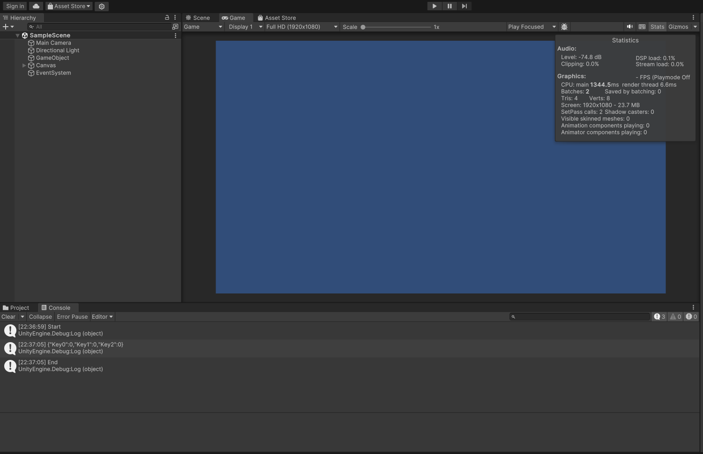

最近一个项目需要在 Unity3D 中做异步 Json 序列化和反序列化，简单记录一下。

<!-- more -->

## 从最简单的开始

首先安装相关库

- 在 Unity Package Manager 中安装 `com.unity.nuget.newtonsoft-json`
- 使用 openupm 安装 `jillejr.newtonsoft.json-for-unity.converters` 可以使用命令 `openupm add jillejr.newtonsoft.json-for-unity.converters`

写一点代码

```cs
public class JsonItem
{
  public int Key0 { get; set; }
  public int Key1 { get; set; }
  public int Key2 { get; set; }
}
```

```cs
using System.Collections.Generic;
using System.IO;
using Models;
using Newtonsoft.Json;
using UnityEngine;

public class JsonT0 : MonoBehaviour
{
  private void Start()
  {
    var s = File.ReadAllText(Path.Combine(Application.streamingAssetsPath, ".data", "s1.json"));
    var j = JsonConvert.DeserializeObject<List<JsonItem>>(s);
    Debug.Log(JsonConvert.SerializeObject(j[0]));
  }
}
```

## 异步加载

其实上面的一段代码其实是有问题的，加载过程会阻塞 Unity 的主进程。

简单做个测试。

```cs
using System.Collections;
using System.Collections.Generic;
using System.IO;
using Models;
using Newtonsoft.Json;
using UnityEngine;
using UnityEngine.UI;

public class JsonT0 : MonoBehaviour
{
  private int _i;
  private Text _text;

  private void Start()
  {
    // 限制60帧左右
    Application.targetFrameRate = 60;

    _text = FindFirstObjectByType<Text>();

    StartCoroutine(nameof(LoadJson));

  }


  private void Update()
  {
    _text.text = _i++.ToString();
  }

  private IEnumerator LoadJson()
  {
    Debug.Log("Start");
    yield return null;

    var s = File.ReadAllText(Path.Combine(Application.streamingAssetsPath, ".data", "s1.json"));
    var j = JsonConvert.DeserializeObject<List<JsonItem>>(s);
    Debug.Log(JsonConvert.SerializeObject(j[0]));

    Debug.Log("End");
  }
}
```


可以看到，程序启动后会卡死一段时间，数值才会增长。

然后改成异步的方式，来看一下。

```cs
using System.Collections;
using System.Collections.Generic;
using System.IO;
using System.Threading.Tasks;
using Models;
using Newtonsoft.Json;
using UnityEngine;
using UnityEngine.UI;

public class JsonT0 : MonoBehaviour
{
  private int _i;
  private Text _text;

  private void Start()
  {
    // 限制60帧左右
    Application.targetFrameRate = 60;

    _text = FindFirstObjectByType<Text>();

    StartCoroutine(nameof(LoadJson));

  }


  private void Update()
  {
    _text.text = _i++.ToString();
  }

  private IEnumerator LoadJson()
  {
    Debug.Log("Start");
    yield return null;

    var a = Task.Run(() =>
    {
      var s = File.ReadAllText(Path.Combine(Application.streamingAssetsPath, ".data", "s1.json"));
      return JsonConvert.DeserializeObject<List<JsonItem>>(s);

    });

    while (!a.IsCompleted)
    {
      yield return null;
    }

    var j = a.Result;
    Debug.Log(JsonConvert.SerializeObject(j[0]));
    Debug.Log("End");
  }
}
```



可以看到，这样就可以正常使用了。

## 拓展

然后再整理一下，写成拓展的形式。

先安装 UniTask 库 `openupm add com.cysharp.unitask`，再创建文件 `JsonSerializerAsyncExtensions.cs`

```cs
using System.IO;
using System.Text;
using Cysharp.Threading.Tasks;
using Newtonsoft.Json;

/// <summary>
///   Json 序列化和反序列化拓展方法
/// </summary>
public static class JsonSerializerAsyncExtensions
{
  /// <summary>
  ///   反序列化
  /// </summary>
  /// <typeparam name="T"></typeparam>
  /// <param name="stream"></param>
  /// <param name="settings"></param>
  /// <returns></returns>
  public static UniTask<T> DeserializeJsonAsync<T>(this Stream stream, JsonSerializerSettings settings = null)
  {
    return UniTask.RunOnThreadPool(() =>
    {
      using var sr = new StreamReader(stream);
      using var jr = new JsonTextReader(sr);
      var s = settings == null ? JsonSerializer.CreateDefault() : JsonSerializer.Create(settings);
      return s.Deserialize<T>(jr);
    });
  }

  /// <summary>
  ///   反序列化
  /// </summary>
  /// <typeparam name="T"></typeparam>
  /// <param name="bytes"></param>
  /// <param name="index"></param>
  /// <param name="count"></param>
  /// <param name="settings"></param>
  /// <returns></returns>
  public static UniTask<T> DeserializeJsonAsync<T>(this byte[] bytes, int index, int count,
    JsonSerializerSettings settings = null)
  {
    var ms = new MemoryStream(bytes, index, count);
    return DeserializeJsonAsync<T>(ms, settings);
  }

  /// <summary>
  ///   反序列化
  /// </summary>
  /// <typeparam name="T"></typeparam>
  /// <param name="bytes"></param>
  /// <param name="settings"></param>
  /// <returns></returns>
  public static UniTask<T> DeserializeJsonAsync<T>(this byte[] bytes, JsonSerializerSettings settings = null)
  {
    return DeserializeJsonAsync<T>(bytes, 0, bytes.Length, settings);
  }

  /// <summary>
  ///   反序列化
  /// </summary>
  /// <typeparam name="T"></typeparam>
  /// <param name="json"></param>
  /// <param name="settings"></param>
  /// <returns></returns>
  public static UniTask<T> DeserializeJsonAsync<T>(this string json, JsonSerializerSettings settings = null)
  {
    var bytes = Encoding.UTF8.GetBytes(json);
    return DeserializeJsonAsync<T>(bytes, settings);
  }


  /// <summary>
  ///   序列化
  /// </summary>
  /// <typeparam name="T"></typeparam>
  /// <param name="instance"></param>
  /// <param name="stream"></param>
  /// <param name="settings"></param>
  /// <returns></returns>
  public static UniTask SerializeToJsonAsync<T>(this T instance, Stream stream,
    JsonSerializerSettings settings = null)
  {
    return UniTask.RunOnThreadPool(() =>
    {
      using var sw = new StreamWriter(stream);
      var s = settings == null ? JsonSerializer.CreateDefault() : JsonSerializer.Create(settings);
      s.Serialize(sw, instance);
    });
  }

  /// <summary>
  ///   序列化
  /// </summary>
  /// <typeparam name="T"></typeparam>
  /// <param name="instance"></param>
  /// <param name="settings"></param>
  /// <returns></returns>
  public static async UniTask<byte[]> SerializeToJsonBytesAsync<T>(this T instance,
    JsonSerializerSettings settings = null)
  {
    using var ms = new MemoryStream();
    await SerializeToJsonAsync(instance, ms, settings);
    return ms.ToArray();
  }

  /// <summary>
  ///   序列化
  /// </summary>
  /// <typeparam name="T"></typeparam>
  /// <param name="instance"></param>
  /// <param name="settings"></param>
  /// <returns></returns>
  public static async UniTask<string> SerializeToJsonStringAsync<T>(this T instance,
    JsonSerializerSettings settings = null)
  {
    var b = await SerializeToJsonBytesAsync(instance, settings);
    return Encoding.UTF8.GetString(b);
  }
}
```

```cs
using System.Collections.Generic;
using System.IO;
using Cysharp.Threading.Tasks;
using Models;
using UnityEngine;
using UnityEngine.UI;

public class JsonT0 : MonoBehaviour
{
  private int _i;
  private Text _text;

  private async UniTaskVoid Start()
  {
    // 限制60帧左右
    Application.targetFrameRate = 60;

    _text = FindFirstObjectByType<Text>();

    Debug.Log("Start");

    await using (var fs = File.OpenRead(Path.Combine(Application.streamingAssetsPath, ".data", "s1.json")))
    {
      var j = await fs.DeserializeJsonAsync<List<JsonItem>>();
      Debug.Log(await j[0].SerializeToJsonStringAsync());
    }

    Debug.Log("End");
  }


  private void Update()
  {
    _text.text = _i++.ToString();
  }
}
```

好了，这样异步加载 Json 的事情就比较完美的解决了。
